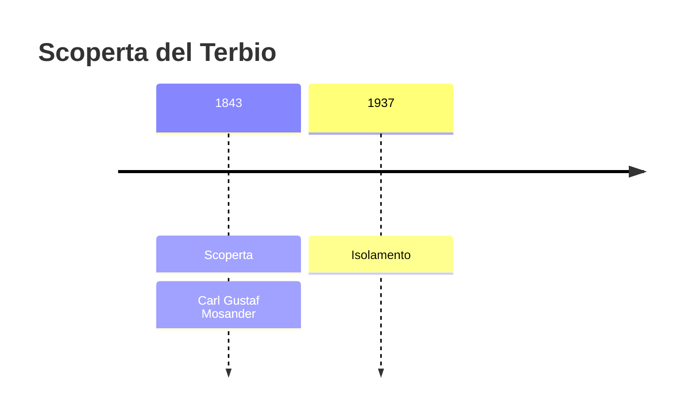
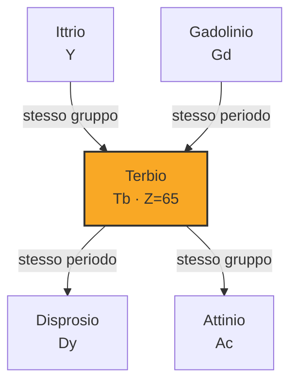
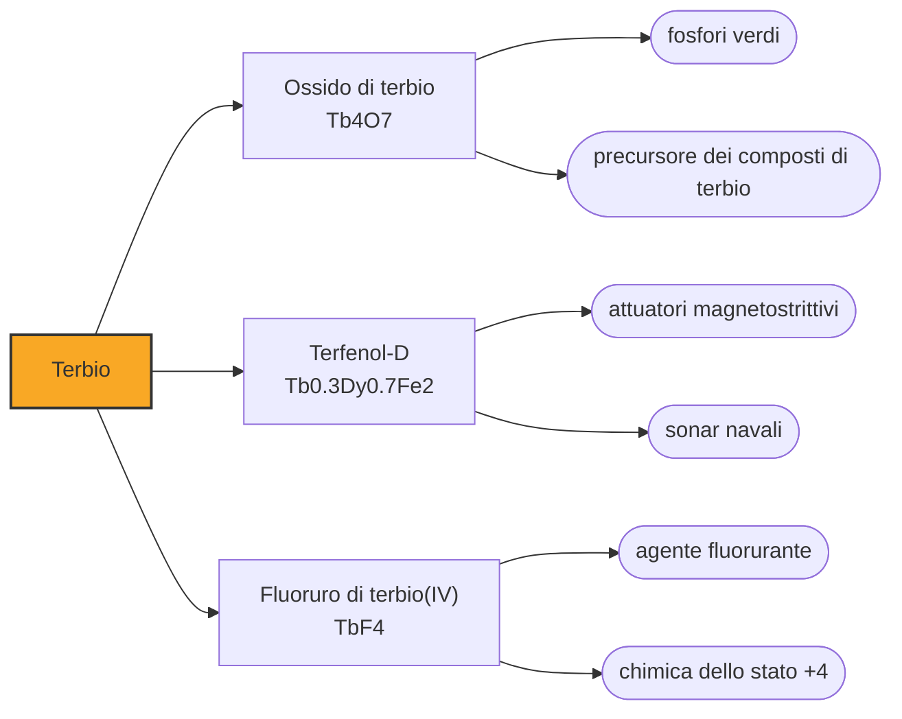

# Terbio (Tb)

> [!abstract] 58° elemento scoperto — 1843
> Mosander divise l'ittria in tre parti e diede un nome a ciascuna. Trent'anni dopo, due di quei nomi si erano scambiati di posto, e nessuno se n'era accorto in tempo per rimediare.

Il terbio è uno dei lantanidi più scarsi e più cari, e vive di due mestieri che non si vedono: fa il verde degli schermi e delle lampade fluorescenti, e in lega con ferro e disprosio cambia di forma quando lo si immerge in un campo magnetico, il che ne fa il cuore di certi attuatori e dei sonar navali.

## Cronologia della scoperta

> [!info] Nota sulla cronologia
> La cronologia adotta il 1843, anno in cui Mosander separò dall'ittria due terre nuove. I nomi delle due finirono scambiati nella letteratura successiva, e il terbio in forma metallica è del 1937.

## Storia della scoperta

Tutto comincia in una cava di feldspato a Ytterby, un'isola dell'arcipelago di Stoccolma, da cui nel Settecento uscì una pietra nera insolita. Quattro elementi portano nel nome pezzi della parola Ytterby — ittrio, itterbio, terbio ed erbio — e altri cinque — scandio, olmio, tulio, gadolinio e tantalio — furono individuati per la prima volta in minerali di quel giacimento.

Dalla pietra di Ytterby era nata nel 1794 l'ittria, considerata per mezzo secolo l'ossido di un elemento solo. Nel 1843 Carl Gustaf Mosander, che aveva già smontato la ceria, applicò all'ittria lo stesso metodo di precipitazioni ripetute e concluse che conteneva tre terre distinte: ne tenne una con il nome vecchio e battezzò le altre due erbia e terbia.

Mosander non era un chimico di formazione: aveva studiato medicina e fatto il chirurgo, ed era arrivato al laboratorio di Berzelius come assistente, finendo per abitare nello stesso edificio dell'Accademia delle scienze. Da quella posizione defilata smontò in quattro anni due delle terre su cui si reggeva la mineralogia del tempo, e consegnò alla chimica quattro elementi che nessuno aveva sospettato.

Quelle due terre erano poche, impure e quasi indistinguibili, e per trent'anni chi le studiava non fu sicuro di quale avesse in mano. Nel lavoro con cui lo spettroscopista svizzero Marc Delafontaine cominciò a metterle in ordine, i nomi delle due comparvero scambiati, e in quella forma passarono nella letteratura: l'elemento che oggi chiamiamo terbio porta il nome che Mosander aveva dato all'altro.

Nella confusione il terbio ebbe anche una breve stagione con un terzo nome, mosandrum, dedicato allo scopritore. Non attecchì, e alla fine dell'Ottocento la coppia terbio-erbio si assestò nell'assegnazione invertita che usiamo ancora: un caso in cui la chimica ha preferito la continuità della letteratura alla fedeltà al battesimo originale.

Il metallo puro arrivò quasi un secolo dopo la scoperta. Le terre rare si separano davvero solo con lo scambio ionico, messo a punto a metà Novecento; prima di allora il terbio si otteneva riducendo il cloruro anidro, come fecero Wilhelm Klemm e Heinrich Bommer nel 1937. Fra l'annuncio di Mosander e il primo campione di metallo passano novantaquattro anni, lo scarto più largo di tutta l'epoca.

## Posizione nella tavola periodica

## Caratteristiche

Come tutti i lantanidi il terbio sta nello stato +3, ma è uno dei pochi — con cerio e praseodimio — a formare composti stabili anche nello stato +4: l'ossido commerciale, il Tb₄O₇, è una miscela dei due stati, ed è quello che si compra quando si compra «ossido di terbio». Il +4 esiste perché a quel punto della serie il guscio f si trova a metà riempimento, una configurazione che la meccanica quantistica favorisce, ed è la stessa ragione per cui il terbio è così magnetico.

È fortemente paramagnetico e, sotto i 219 kelvin, diventa ferromagnetico: a temperatura ambiente il magnetismo non regge, ma è abbastanza intenso da rendere il terbio utile là dove serve una risposta magnetica molto marcata, in lega con elementi che quel magnetismo lo tengono anche al caldo.

Nella crosta terrestre è a 1,2 parti per milione, poco più di un trentesimo del neodimio, e non esiste nessun minerale in cui il terbio sia l'elemento dominante: si ricava sempre come frazione minoritaria di altri, e oggi le fonti commerciali più ricche sono le argille ad adsorbimento ionico della Cina meridionale.

### Dati fisico-chimici

| Proprietà | Valore |
|---|---|
| Numero atomico | 65 |
| Massa atomica | 158,925352 u |
| Categoria | Lantanide |
| Gruppo | 3 |
| Periodo | 6 |
| Blocco | f |
| Configurazione elettronica | [Xe] 4f⁹ 6s² |
| Punto di fusione | 1355,9 °C |
| Punto di ebollizione | 3122,9 °C |
| Densità | 8,23 g/cm³ |
| Stati di ossidazione | +3, +4 |

## Struttura atomica

![[atomo-Terbio.svg]]

## Usi e presenza in natura

L'impiego che ne consuma di più sono i fosfori: l'ossido di terbio dà il verde nelle lampade fluorescenti tricromatiche e negli schermi, dove tre polveri — una rossa all'europio, una verde al terbio, una blu — sommano una luce che l'occhio legge come bianca. Poche righe strette al posto di uno spettro continuo, ed è per questo che le lampade a risparmio hanno quella resa dei colori.

Il Terfenol-D, lega di terbio, disprosio e ferro, ha la magnetostrizione più alta fra le leghe conosciute: si allunga e si accorcia sotto un campo magnetico abbastanza da essere usato come attuatore di precisione e come sorgente sonora nei sonar navali. È un impiego di nicchia, ma è quello che rende il terbio un materiale strategico.

Una quota crescente finisce nei magneti al neodimio: aggiungere terbio o disprosio alza la temperatura alla quale il magnete perde le proprie proprietà, e per un motore elettrico che lavora sotto carico è la differenza fra funzionare e smagnetizzarsi. È il motivo per cui la domanda di terbio segue quella delle automobili elettriche.

## Curiosità

Ytterby è il luogo che ha dato più nomi alla tavola periodica di qualunque altro sulla Terra, e non è una città né una miniera famosa: è una cava di feldspato lunga poche centinaia di metri, in un'isola dove oggi ci sono case e un molo.

I composti di terbio fluorescono in verde sotto la luce ultravioletta, e questa proprietà è stata usata negli inchiostri di sicurezza: alcune banconote in euro mostrano, sotto la lampada di Wood, disegni che a occhio nudo non ci sono.

## Nella cronologia

← Precedente: [[Neodimio]] (1841)
→ Successivo: [[Erbio]] (1843)

Epoca: [[L'età dell'elettrolisi]] · Scopritore: [[Carl Gustaf Mosander]]

## Fonti

- [Terbium](https://en.wikipedia.org/wiki/Terbium) — consultata il 09/09/2026
- [Terbium — Royal Society of Chemistry](https://periodic-table.rsc.org/element/65/terbium) — consultata il 09/09/2026
- [Ytterby](https://en.wikipedia.org/wiki/Ytterby) — consultata il 09/09/2026
