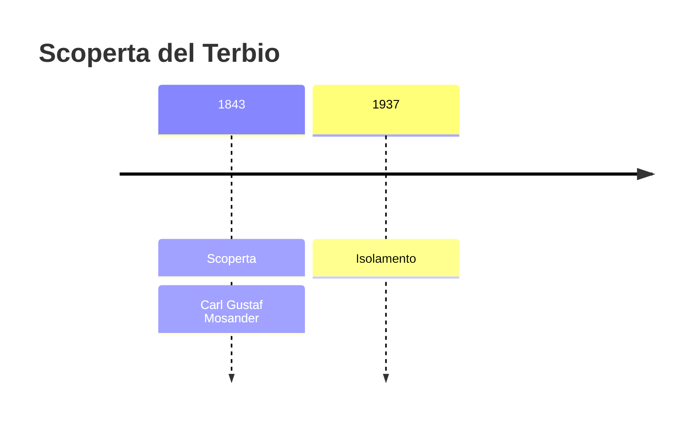
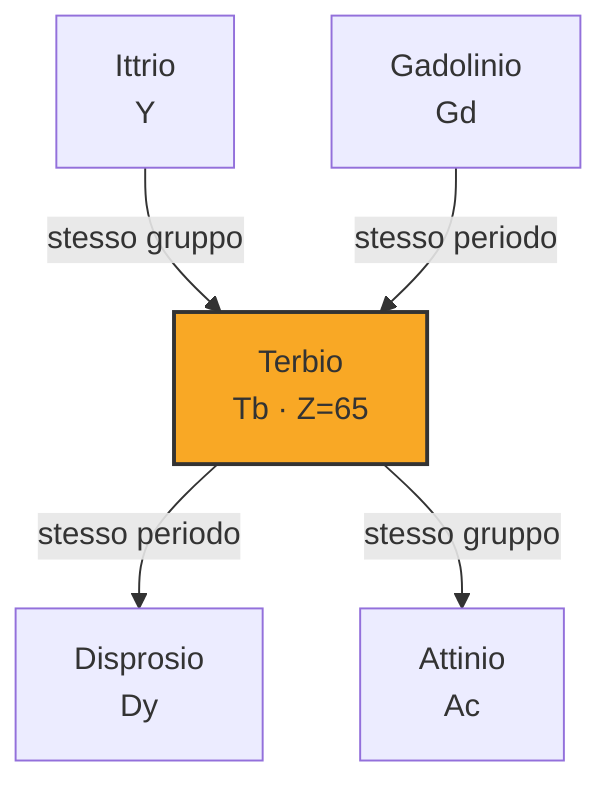

# Terbio (Tb)

> [!abstract] 58° elemento scoperto — 1843
> 

## Cronologia della scoperta

## Storia della scoperta

## Posizione nella tavola periodica

## Caratteristiche

### Dati fisico-chimici

| Proprietà | Valore |
|---|---|
| Numero atomico | 65 |
| Massa atomica | 158,925352 u |
| Categoria | Lantanide |
| Gruppo | 3 |
| Periodo | 6 |
| Blocco | f |
| Configurazione elettronica | [Xe] 4f⁹ 6s² |
| Punto di fusione | 1355,9 °C |
| Punto di ebollizione | 3122,9 °C |
| Densità | 8,23 g/cm³ |
| Stati di ossidazione | — |

## Struttura atomica

![[atomo-Terbio.svg]]

## Usi e presenza in natura

## Nella cronologia

← Precedente: [[Neodimio]] (1841)
→ Successivo: [[Erbio]] (1843)

Epoca: [[L'età dell'elettrolisi]] · Scopritore: [[Carl Gustaf Mosander]]

## Fonti

