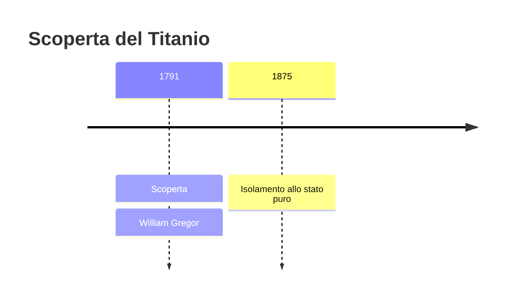
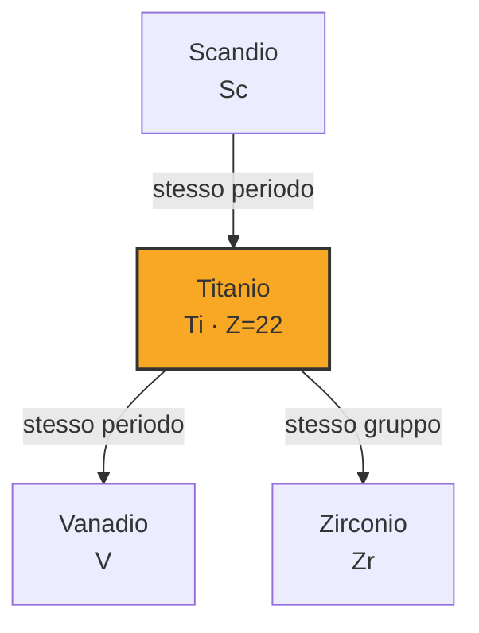

# Titanio (Ti)

> [!abstract] 36° elemento scoperto — 1791
> 

## Cronologia della scoperta

## Storia della scoperta

## Posizione nella tavola periodica

## Caratteristiche

### Dati fisico-chimici

| Proprietà | Valore |
|---|---|
| Numero atomico | 22 |
| Massa atomica | 47,8671 u |
| Categoria | Metallo di transizione |
| Gruppo | 4 |
| Periodo | 4 |
| Blocco | d |
| Configurazione elettronica | [Ar] 3d² 4s² |
| Punto di fusione | 1667,9 °C |
| Punto di ebollizione | 3286,9 °C |
| Densità | 4,506 g/cm³ |
| Stati di ossidazione | — |

## Struttura atomica

![[atomo-Titanio.svg]]

## Usi e presenza in natura

## Nella cronologia

← Precedente: [[Stronzio]] (1790)
→ Successivo: [[Ittrio]] (1794)

Epoca: [[Chimica pneumatica]] · Scopritore: [[William Gregor]]

## Fonti

