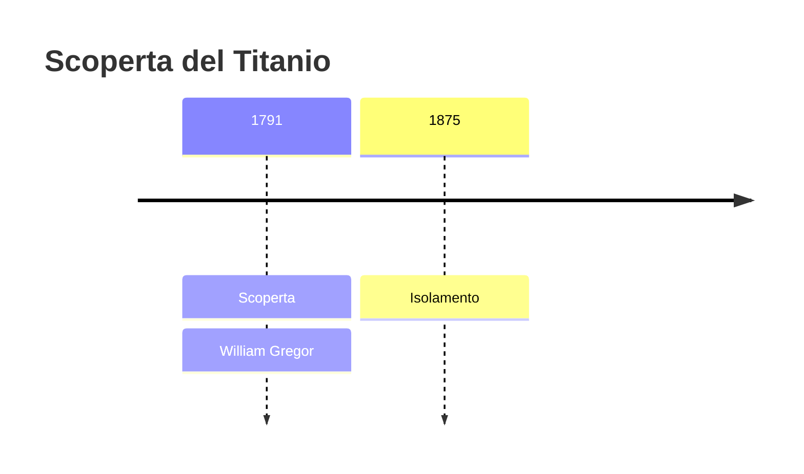
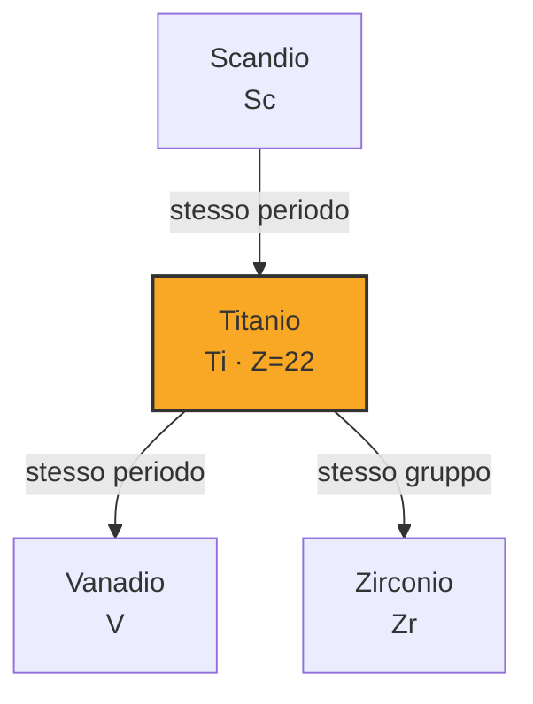
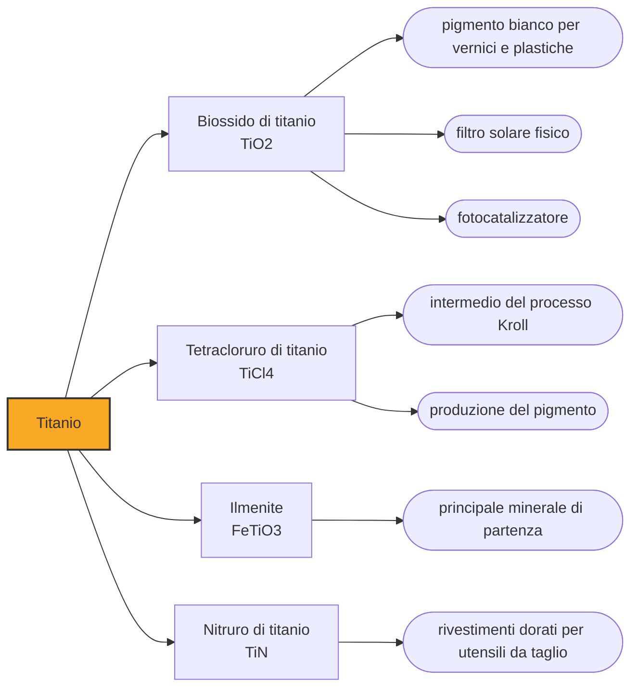

# Titanio (Ti)

> [!abstract] 36° elemento scoperto — 1791
> Un parroco di campagna raccolse una sabbia nera in un ruscello della Cornovaglia e vi trovò un elemento sconosciuto. Ci vollero più di cent'anni per riuscire a farne un pezzo di metallo.

Il titanio è il metallo che riunisce quattro pregi che altrove si trovano soltanto separati: forte quanto molti acciai, poco più della metà pesante, praticamente incorruttibile e tollerato dal corpo umano come nessun altro metallo. Preso singolarmente, ciascuno di questi pregi ha altrove un campione migliore; è averli tutti e quattro insieme che non riesce a nessun altro metallo. È il nono elemento della crosta terrestre per abbondanza, il che rende curioso che per un secolo sia stato impossibile procurarsene un frammento pulito.

## Cronologia della scoperta

> [!info] Nota sulla cronologia
> William Gregor riconosce l'elemento nel 1791 nella sabbia nera del torrente di Manaccan, in Cornovaglia; Klaproth lo ritrova indipendentemente nel rutilo nel 1795 e gli dà il nome dei Titani. Il metallo quasi puro è ottenuto nel 1875 da Dmitrij Kirillov; una purezza del 99,9 per cento arriva solo nel 1910 con Matthew Hunter, e la produzione industriale con il processo Kroll degli anni Trenta e Quaranta.

## Storia della scoperta

Nel 1791 il reverendo William Gregor è un ecclesiastico anglicano del Devon e mineralogista per passione, come parecchi uomini di chiesa britannici del suo secolo, che avevano istruzione, tempo e curiosità in quantità sufficiente; di lì a due anni sarebbe diventato rettore di Creed, in Cornovaglia. Raccoglie nella valle di Manaccan una sabbia nera e magnetica depositata da un ruscello, di quelle che chiunque avrebbe scambiato per un residuo di ferro, e decide di analizzarla.

L'analisi gli restituisce ferro, come previsto, e poi un residuo che non ha previsto: quasi metà del campione è un ossido bianco che non si scioglie in quel che dovrebbe, non corrisponde a nessuna terra nota e resiste a ogni tentativo di ricondurlo a qualcosa di catalogato. Gregor conclude che contiene un metallo nuovo, lo chiama menachanite dal nome del luogo e pubblica il risultato senza far rumore. Il mondo chimico non se ne occupa.

Quattro anni dopo, senza sapere nulla del parroco, Martin Heinrich Klaproth analizza a Berlino un minerale rosso ungherese, il rutilo, e vi trova lo stesso ossido sconosciuto. Il nome glielo dà lui, e lo prende dalla mitologia invece che dalla geografia: titanio, dai Titani, i figli della Terra anteriori agli dei dell'Olimpo.

Nel 1797 Klaproth legge finalmente la memoria che il parroco aveva pubblicato sei anni prima, confronta le due sostanze e riconosce che sono la stessa cosa trovata in due minerali diversi: la priorità è di Gregor. Ne esce un'attribuzione a due voci che regge ancora — a Gregor la scoperta, a Klaproth il nome. È la prima di due volte in pochi mesi in cui il berlinese si trova nella posizione di poter incassare il lavoro di un altro e sceglie invece di dichiararlo: nel gennaio successivo farà lo stesso con il tellurio.

Ottenere il metallo si rivela un problema di un ordine di difficoltà superiore, perché il titanio caldo si combina avidamente con l'ossigeno, l'azoto e il carbonio, cioè con tutto ciò che sta in un forno e nell'aria che lo circonda: quel che si otteneva era sempre un composto fragile travestito da metallo. Un campione quasi puro è ottenuto nel 1875 dal russo Dmitrij Kirillov, una purezza del 99,9 per cento solo nel 1910 da Matthew Hunter, che fece reagire il tetracloruro con il sodio in una bomba d'acciaio sigillata.

Il passaggio dalla rarità di laboratorio al metallo industriale porta il nome di William Kroll, che negli anni Trenta mette a punto la riduzione del tetracloruro di titanio con il magnesio sotto atmosfera inerte. Il procedimento è lento, discontinuo ed energivoro, e per questo il titanio costa molte volte più dell'acciaio pur essendo incomparabilmente più diffuso; novant'anni dopo, il processo Kroll è ancora il modo in cui si fabbrica quasi tutto il titanio del mondo.

## Posizione nella tavola periodica

## Caratteristiche

La combinazione che rende il titanio unico è aritmetica prima che chimica. Ha una densità di circa 4,5 grammi per centimetro cubo, poco più della metà di quella dell'acciaio, e in lega raggiunge resistenze meccaniche paragonabili o superiori: a parità di carico da sopportare, un pezzo di titanio pesa quasi la metà. Dove il peso costa carburante o fatica muscolare, questa differenza vale il prezzo che il metallo si fa pagare.

La sua resistenza alla corrosione nasce paradossalmente dalla sua reattività. Il titanio si ossida istantaneamente, ma lo strato di ossido che si forma è sottilissimo, aderente e impermeabile, e si richiude da solo ogni volta che viene graffiato: sotto quella pellicola il metallo resta intatto nell'acqua di mare, negli acidi ossidanti e nei fluidi del corpo. Lo stesso strato, ispessito per via elettrochimica, produce per interferenza i colori vivaci del titanio anodizzato.

Quella stessa pellicola spiega il rapporto singolare fra titanio e corpo umano. L'organismo non la riconosce come estranea da attaccare, e l'osso arriva a crescere a contatto diretto con la superficie fino a saldarvisi: il fenomeno si chiama osteointegrazione ed è la ragione per cui gli impianti dentali, le protesi d'anca e le placche per le fratture si fanno di titanio invece che di un metallo più economico.

### Dati fisico-chimici

| Proprietà | Valore |
|---|---|
| Numero atomico | 22 |
| Massa atomica | 47,8671 u |
| Categoria | Metallo di transizione |
| Gruppo | 4 |
| Periodo | 4 |
| Blocco | d |
| Configurazione elettronica | [Ar] 3d² 4s² |
| Punto di fusione | 1667,9 °C |
| Punto di ebollizione | 3286,9 °C |
| Densità | 4,506 g/cm³ |
| Stati di ossidazione | -2, -1, +1, +2, +3, +4 |

## Struttura atomica

![[atomo-Titanio.svg]]

## Usi e presenza in natura

Il grosso del titanio estratto, però, non diventa mai metallo. La quota largamente prevalente finisce come biossido di titanio, il pigmento bianco più usato al mondo: copre e riflette la luce meglio di qualunque alternativa ed è chimicamente inerte, per cui sta nelle vernici, nelle plastiche, nella carta, nelle creme solari e nei dentifrici. Il bianco che vediamo intorno a noi è, quasi sempre, titanio.

Il metallo va invece dove il prezzo si giustifica da solo. L'aeronautica ne fa strutture, carrelli e soprattutto parti fredde dei motori a reazione; la chimica ne fa scambiatori e reattori per fluidi che divorerebbero l'acciaio; il mare ne fa eliche, valvole e impianti di dissalazione. A questi si aggiungono lo sport e l'oreficeria, dove si pagano volentieri leggerezza e anallergia.

## Curiosità

L'aereo spia più veloce mai costruito era fatto quasi tutto di titanio, perché volando a oltre tre volte la velocità del suono l'attrito con l'aria gli scaldava la pelle a temperature alle quali l'alluminio si ammorbidisce. Su come gli Stati Uniti si procurassero tanto titanio circola da decenni un racconto gustoso: che la CIA lo comprasse di nascosto, tramite società di comodo e paesi terzi, dal maggior produttore mondiale del minerale, cioè dall'Unione Sovietica che quegli aerei dovevano fotografare. La storia è accettata da molti storici e dai veterani del programma, ma risale essenzialmente alle memorie di un dirigente del progetto e non a documenti declassificati.

C'è una simmetria involontaria nei nomi che Klaproth distribuì in pochi anni. Al metallo della sabbia nera diede il nome dei Titani, figli di Gaia, la Terra; al metallo transilvano quello di tellus, la Terra latina; a un altro ancora quello del pianeta Urano, che nel mito è lo sposo di Gaia e il padre dei Titani. Un solo analista berlinese ha messo sulla tavola periodica una famiglia mitologica quasi al completo.

## Nella cronologia

← Precedente: [[Stronzio]] (1790)
→ Successivo: [[Ittrio]] (1794)

Epoca: [[Chimica pneumatica]] · Scopritore: [[William Gregor]]

## Fonti

- [Titanium](https://en.wikipedia.org/wiki/Titanium) — consultata il 07/09/2026
- [William Gregor](https://en.wikipedia.org/wiki/William_Gregor) — consultata il 07/09/2026
- [Titanium (Encyclopedia.com)](https://www.encyclopedia.com/science-and-technology/chemistry/compounds-and-elements/titanium) — consultata il 07/09/2026
- [Kroll process](https://en.wikipedia.org/wiki/Kroll_process) — consultata il 07/09/2026
