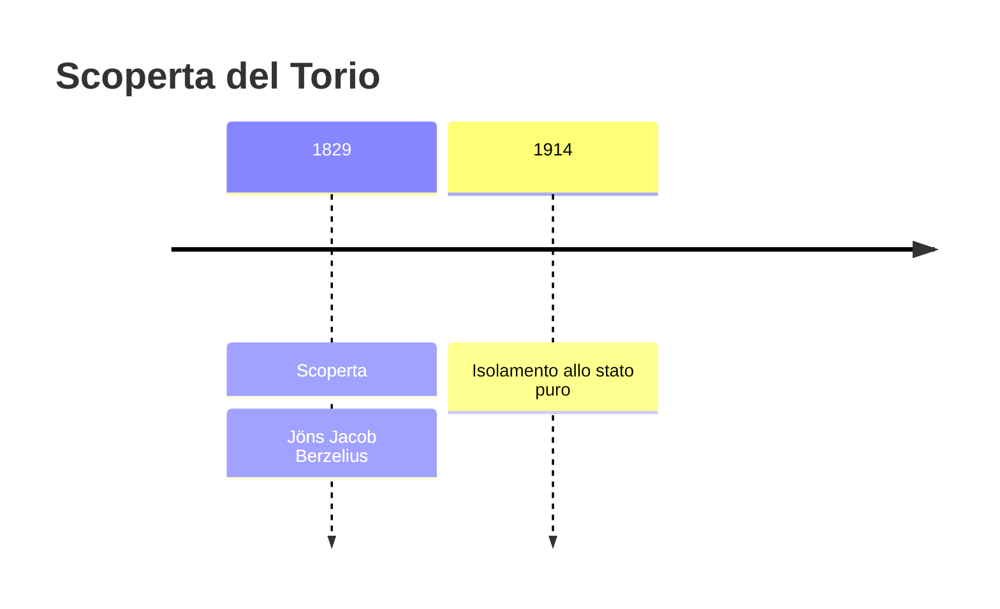
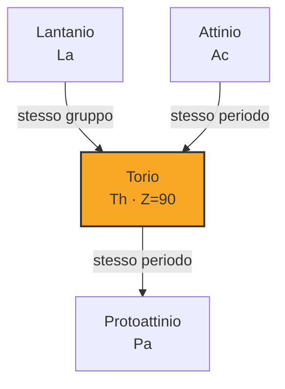

# Torio (Th)

> [!abstract] 55° elemento scoperto — 1829
> 

## Cronologia della scoperta

## Storia della scoperta

## Posizione nella tavola periodica

## Caratteristiche

### Dati fisico-chimici

| Proprietà | Valore |
|---|---|
| Numero atomico | 90 |
| Massa atomica | 232,03774 u |
| Categoria | Attinide |
| Gruppo | 3 |
| Periodo | 7 |
| Blocco | f |
| Configurazione elettronica | [Rn] 6d² 7s² |
| Punto di fusione | 1749,9 °C |
| Punto di ebollizione | 4787,9 °C |
| Densità | 11,724 g/cm³ |
| Stati di ossidazione | — |

## Struttura atomica

![[atomo-Torio.svg]]

## Usi e presenza in natura

## Nella cronologia

← Precedente: [[Bromo]] (1825)
→ Successivo: [[Lantanio]] (1838)

Epoca: [[L'età dell'elettrolisi]] · Scopritore: [[Jöns Jacob Berzelius]]

## Fonti

