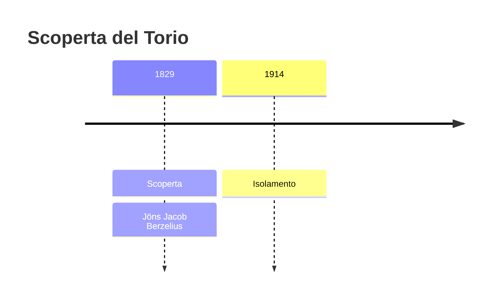
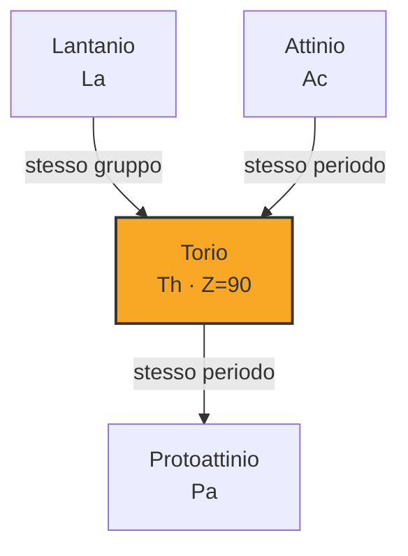
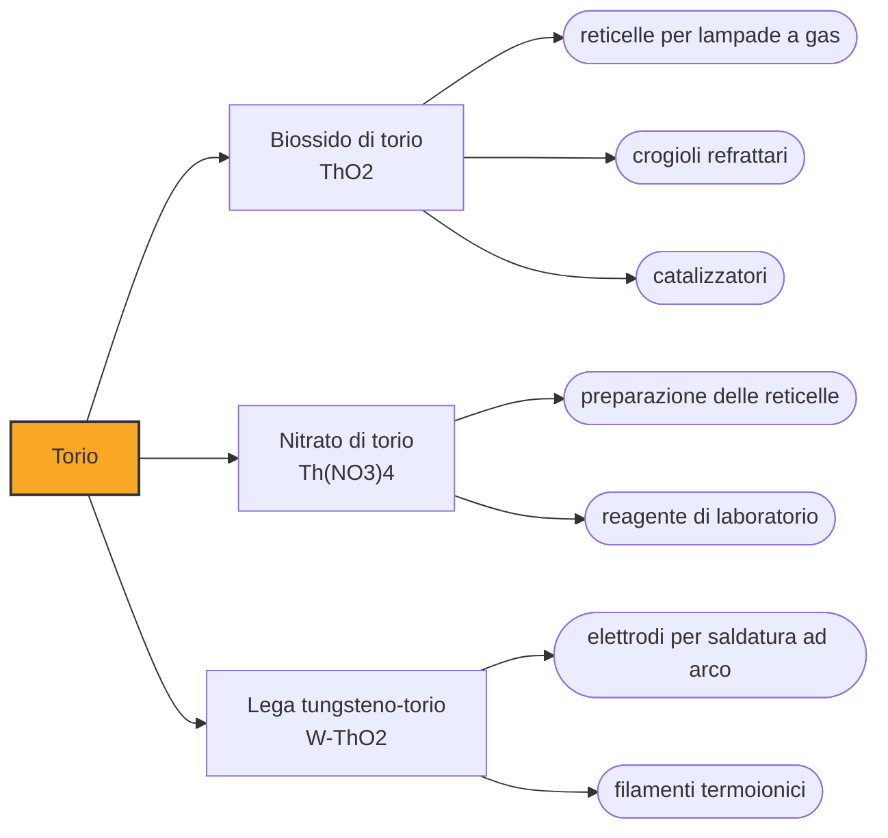

# Torio (Th)

> [!abstract] 55° elemento scoperto — 1829
> Berzelius annunciò il torio due volte. La prima, nel 1815, si sbagliava, e ritrattò nove anni dopo. La seconda, nel 1829, aveva davanti un minerale nero mandatogli da un pastore norvegese.

Il torio è un metallo argenteo, denso quanto il piombo e con un punto di fusione fra i più alti della tavola periodica. È debolmente radioattivo, tre volte più abbondante dell'uranio nella crosta terrestre, e per quasi un secolo la sua carriera principale è stata illuminare le strade, molto prima che qualcuno pensasse di usarlo in un reattore.

## Cronologia della scoperta

> [!info] Nota sulla cronologia
> Berzelius aveva già usato il nome «torio» nel 1815 per una terra che nel 1824 si rivelò fosfato di ittrio. L'elemento vero arrivò nel 1829, dal minerale nero raccolto da Morten Thrane Esmark a Løvøya. La radioattività fu riconosciuta nel 1898, indipendentemente da Gerhard Carl Schmidt e Marie Curie. Isolato in forma pura al 99 per cento nel 1914 da Dirk Lely Jr. e Lodewijk Hamburger.

## Storia della scoperta

Nel 1815 Jöns Jacob Berzelius analizzò un campione di gadolinite e credette di avervi trovato una terra nuova. La battezzò in privato torio, dal nome del dio norreno del tuono, e per nove anni la trattò come un elemento. Nel 1824 dovette ricredersi: quello che aveva in mano era fosfato di ittrio, e il nome restò libero.

Nel 1828 Morten Thrane Esmark, pastore protestante e mineralogista per passione, raccolse a Løvøya, nel sud della Norvegia, un minerale nero che non riusciva a classificare, e lo mandò al padre, professore di mineralogia, che a sua volta lo girò a Berzelius.

Berzelius vi riconobbe l'ossido di un metallo nuovo, e stavolta aveva ragione. Pubblicò nel 1829, riducendo con potassio il fluoruro doppio per ottenere un campione impuro del metallo, e al minerale diede il nome di torite. Il nome che aveva sprecato quattordici anni prima trovava finalmente l'elemento giusto.

Per settant'anni il torio fu un elemento come gli altri, catalogato fra i metalli rari e senza impieghi. Nel 1898, indipendentemente, Gerhard Carl Schmidt a Erlangen e Marie Curie a Parigi scoprirono che i suoi composti emettevano radiazioni come quelli dell'uranio: era il secondo elemento riconosciuto radioattivo, e fu esaminando i minerali di torio e uranio che i Curie arrivarono al polonio e al radio.

Il metallo puro, invece, arrivò tardi. Solo nel 1914 Dirk Lely junior e Lodewijk Hamburger ne ottennero un campione al novantanove per cento, e la produzione affidabile richiese il processo al cristallo di iodio messo a punto negli anni Venti: fino ad allora il torio si maneggiava quasi sempre come ossido.

## Posizione nella tavola periodica

## Caratteristiche

Il torio naturale è quasi tutto torio-232, che decade con un'emivita di quattordici miliardi di anni — più dell'età dell'universo — e proprio per questo è ancora qui in quantità: la sua radioattività è debole, ma la catena di decadimento che ne discende produce radon e altri figli molto più attivi, ed è quella, non il torio in sé, il problema di chi lo maneggia.

È denso 11,7 grammi per centimetro cubo e fonde a 1750 gradi; il suo ossido supera i 3300 gradi, uno dei punti di fusione più alti fra tutti gli ossidi. Appena tagliato è lucente, ma all'aria si opacizza passando al grigio e poi al nero, e in polvere fine è piroforico: si accende da solo.

La sua chimica è semplice quanto quella di un lantanide: il torio sta praticamente sempre nello stato +4, con ioni incolori, e i complessi in cui scende a +3 o a +2 sono curiosità da laboratorio, sintetizzate per capire come si comportano gli orbitali f. Questa monotonia lo rende più simile allo zirconio e all'afnio che agli attinidi che gli stanno accanto, ed è la ragione per cui la sua collocazione nella tavola periodica ha richiesto decenni per essere accettata.

### Dati fisico-chimici

| Proprietà | Valore |
|---|---|
| Numero atomico | 90 |
| Massa atomica | 232,03774 u |
| Categoria | Attinide |
| Gruppo | 3 |
| Periodo | 7 |
| Blocco | f |
| Configurazione elettronica | [Rn] 6d² 7s² |
| Punto di fusione | 1749,9 °C |
| Punto di ebollizione | 4787,9 °C |
| Densità | 11,724 g/cm³ |
| Stati di ossidazione | +2, +3, +4 |

## Struttura atomica

![[atomo-Torio.svg]]

## Usi e presenza in natura

L'impiego che ha consumato più torio è oggi quasi scomparso. Il biossido, scaldato dalla fiamma di una lampada a gas, emette una luce bianca intensissima: su questo Carl Auer von Welsbach costruì la reticella incandescente, che fra la fine dell'Ottocento e i primi decenni del Novecento illuminò strade e case di mezzo mondo prima che la lampadina elettrica prendesse il sopravvento.

Gli altri impieghi storici sfruttano la refrattarietà e l'indice di rifrazione: crogioli per fondere metalli ad altissima temperatura, elettrodi per la saldatura ad arco con tungsteno, lenti di obiettivi ad alte prestazioni. Quasi tutti sono stati abbandonati o sostituiti quando la radioattività dei materiali è diventata un criterio di scelta.

Il futuro che gli si attribuisce da settant'anni è invece nucleare. Il torio-232 non è fissile, ma assorbendo un neutrone diventa uranio-233, che lo è: un reattore a torio funziona solo se qualcosa lo innesca e lo mantiene, in cambio di una risorsa tre volte più abbondante dell'uranio e di scorie a vita più breve. Reattori sperimentali ne sono stati costruiti fin dagli anni Sessanta; una filiera commerciale, finora, no.

## Curiosità

Il torio si estrae quasi esclusivamente dalla monazite, che è anche uno dei minerali delle terre rare: chi cerca neodimio per i magneti si ritrova fra le mani torio radioattivo di cui deve rispondere, ed è una delle ragioni per cui la lavorazione delle terre rare è finita concentrata dove le regole erano meno severe.

Il nome viene da Thor, il dio norreno del tuono, ed è uno dei pochi casi in cui un elemento porta il nome di una divinità nordica invece che greca o romana. Berzelius lo aveva scelto per un elemento che non esisteva, e lo tenne in serbo quattordici anni prima di trovargli un titolare.

## Nella cronologia

← Precedente: [[Bromo]] (1825)
→ Successivo: [[Lantanio]] (1838)

Epoca: [[L'età dell'elettrolisi]] · Scopritore: [[Jöns Jacob Berzelius]]

## Fonti

- [Thorium](https://en.wikipedia.org/wiki/Thorium) — consultata il 09/09/2026
- [Thorium — Royal Society of Chemistry](https://periodic-table.rsc.org/element/90/thorium) — consultata il 09/09/2026
- [Thorium fuel cycle](https://en.wikipedia.org/wiki/Thorium_fuel_cycle) — consultata il 09/09/2026
