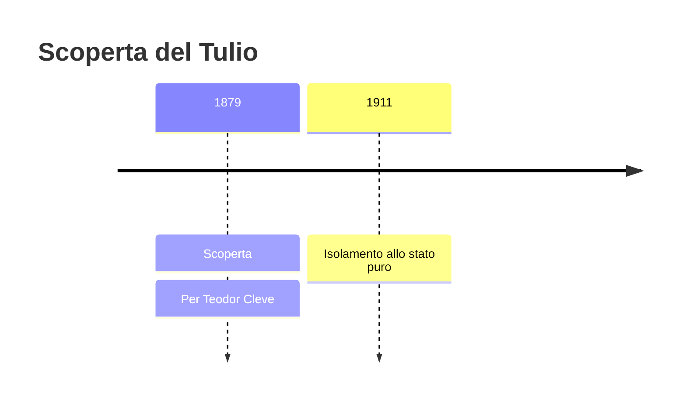
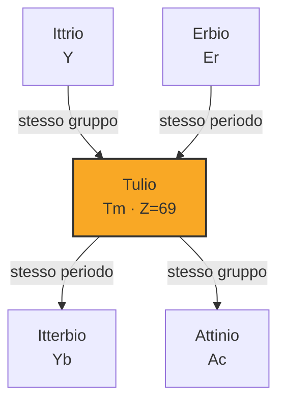

# Tulio (Tm)

> [!abstract] 71° elemento scoperto — 1879
> 

## Cronologia della scoperta

## Storia della scoperta

## Posizione nella tavola periodica

## Caratteristiche

### Dati fisico-chimici

| Proprietà | Valore |
|---|---|
| Numero atomico | 69 |
| Massa atomica | 168,934222 u |
| Categoria | Lantanide |
| Gruppo | 3 |
| Periodo | 6 |
| Blocco | f |
| Configurazione elettronica | [Xe] 4f¹³ 6s² |
| Punto di fusione | 1544,9 °C |
| Punto di ebollizione | 1949,9 °C |
| Densità | 9,32 g/cm³ |
| Stati di ossidazione | — |

## Struttura atomica

![[atomo-Tulio.svg]]

## Usi e presenza in natura

## Nella cronologia

← Precedente: [[Samario]] (1879)
→ Successivo: [[Gadolinio]] (1880)

Epoca: [[Spettroscopia e radioattività]] · Scopritore: [[Per Teodor Cleve]]

## Fonti

