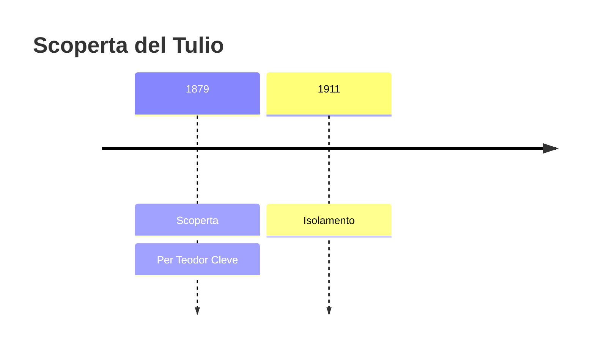
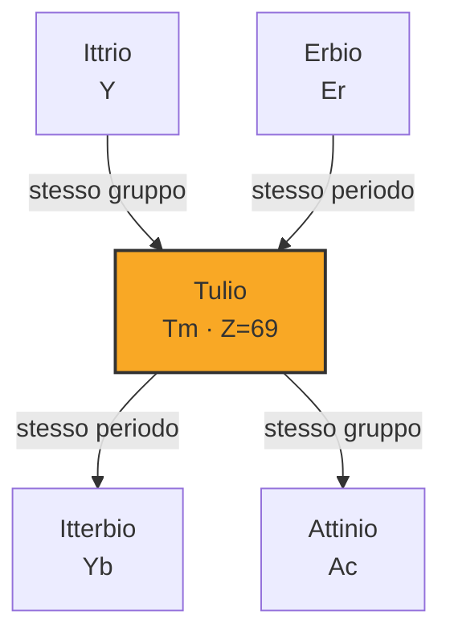
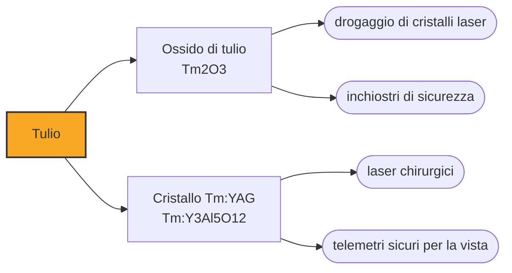

# Tulio (Tm)

> [!abstract] 71° elemento scoperto — 1879
> Per ottenere un campione puro del lantanide più raro ci vollero quindicimila ricristallizzazioni, fatte a mano, una dopo l'altra, dallo stesso uomo.

Il tulio è il meno abbondante dei lantanidi stabili: nella crosta terrestre è a mezza parte per milione, meno dell'oro secondo alcune stime. Per un secolo è stato una curiosità costosa da laboratorio, e solo di recente ha trovato impieghi che lo giustificano: sorgenti portatili di raggi X e laser chirurgici.

## Cronologia della scoperta

> [!info] Nota sulla cronologia
> La fonte attribuiva l'isolamento del 1911 a 'H. Nilson', ma la verifica indica Charles James come primo isolatore del tulio puro: lo scopritore riconosciuto qui è solo Cleve, autore dell'osservazione del 1879.

## Storia della scoperta

Nel 1879 Per Teodor Cleve, a Uppsala, applicò all'erbia un metodo di esclusione: toglieva sistematicamente tutti i contaminanti che sapeva riconoscere e guardava che cosa restava. Restarono due sostanze che non corrispondevano a nulla, e le chiamò holmia e thulia — la prima dal nome latino di Stoccolma, la seconda da Thule, il paese ai confini del mondo che i greci collocavano all'estremo nord.

Il nome era una dichiarazione di appartenenza: la Scandinavia aveva dato all'Europa la cava di Ytterby, la scuola di Berzelius e mezza tavola periodica delle terre rare, e chiamare un elemento con il nome mitico del nord era il modo di dirlo. In pochi anni Cleve, Nilson, Mosander e Marignac avevano riempito di toponimi scandinavi una porzione intera della tavola.

Ottenere il tulio puro fu un'impresa di pazienza più che di ingegno. All'inizio del Novecento l'americano Charles James, all'Università del New Hampshire, mise a punto un metodo di cristallizzazione frazionata dei bromati e lo ripeté migliaia di volte: ogni passaggio arricchiva la frazione di una quantità minima, e per arrivare al campione puro del 1911 si stima che ne abbia eseguiti circa quindicimila. È il tipo di lavoro che nessuno rifarebbe oggi, e che le resine a scambio ionico avrebbero sbrigato in un pomeriggio quarant'anni dopo.

Il metallo vero e proprio arrivò più tardi ancora, nel 1936, per mano di Wilhelm Klemm e Heinrich Bommer, che in quegli anni stavano ricavando uno dopo l'altro i metalli dei lantanidi riducendone i cloruri anidri. Fra l'annuncio di Cleve e il primo pezzo di tulio metallico passarono cinquantasette anni.

## Posizione nella tavola periodica

## Caratteristiche

Con circa mezza parte per milione nella crosta terrestre il tulio è il meno abbondante dei lantanidi, se si esclude il promezio, che è radioattivo e in natura praticamente non esiste. La sua rarità però non è di quelle drammatiche: è comunque più comune di argento, oro e platino, e la ragione per cui costa è che va separato da tredici elementi che gli somigliano.

Chimicamente si comporta come i suoi vicini: cede tre elettroni e forma ioni Tm³⁺, i cui sali sono di un verde pallido; in condizioni riducenti può scendere allo stato +2, come fanno anche europio, samario e itterbio. È tenero, malleabile, argenteo, e all'aria si ossida lentamente.

Il tulio sta quasi in fondo alla serie dei lantanidi, dove la cosiddetta contrazione lantanidica ha già fatto il suo lavoro: man mano che il guscio f si riempie, gli ioni diventano progressivamente più piccoli invece di crescere. È questa contrazione a rendere i lantanidi pesanti così simili fra loro e così difficili da separare, ed è anche la ragione per cui gli elementi del periodo successivo hanno raggi atomici inaspettatamente piccoli.

### Dati fisico-chimici

| Proprietà | Valore |
|---|---|
| Numero atomico | 69 |
| Massa atomica | 168,934222 u |
| Categoria | Lantanide |
| Gruppo | 3 |
| Periodo | 6 |
| Blocco | f |
| Configurazione elettronica | [Xe] 4f¹³ 6s² |
| Punto di fusione | 1544,9 °C |
| Punto di ebollizione | 1949,9 °C |
| Densità | 9,32 g/cm³ |
| Stati di ossidazione | +2, +3 |

## Struttura atomica

![[atomo-Tulio.svg]]

## Usi e presenza in natura

L'isotopo tulio-170 si produce irraggiando il tulio naturale in un reattore, ed emette raggi X di energia adatta alla radiografia: sigillato in una capsula diventa una sorgente portatile che funziona per circa un anno senza corrente elettrica. Si usa per controllare saldature e componenti dove un apparecchio radiologico non arriva — dentro una condotta, in cima a un traliccio, in un cantiere isolato — e in odontoiatria, dove serve poca energia e molta maneggevolezza.

Nei cristalli laser il tulio emette intorno ai due micrometri, in una finestra che l'acqua assorbe fortemente e che l'atmosfera lascia passare: se ne fanno bisturi ottici per la chirurgia dei tessuti molli e telemetri e sistemi di misura che devono lavorare all'aperto senza rischiare di danneggiare la vista di chi guarda.

Una parte dei composti di tulio finisce negli inchiostri di sicurezza: sotto la luce ultravioletta emettono una fluorescenza blu netta e difficile da imitare, e per questo sono fra le sostanze usate nelle banconote in euro come misura antifalsificazione.

Nel 2005 la polvere di tulio metallico al novantanove per cento costava intorno ai settanta dollari al grammo: un prezzo che non dipende dalla scarsità in natura ma dal numero di passaggi di separazione necessari per arrivarci, ed è la ragione per cui il tulio compare solo dove nessun altro elemento fa lo stesso lavoro.

## Curiosità

Charles James, l'uomo delle quindicimila cristallizzazioni, arrivò anche a isolare il lutezio nello stesso periodo di Georges Urbain e Carl Auer von Welsbach, ma non rivendicò la priorità e lasciò la disputa agli altri due. Il suo metodo di separazione, invece, restò lo standard per decenni.

I lantanidi pesanti come il tulio si legano al calcio delle ossa e vi restano a lungo, e per questo la loro tossicità si misura sul lungo periodo più che sull'immediato. In compenso non hanno alcun ruolo biologico noto: nessun organismo, per quanto si sappia, ha imparato a usarli.

## Nella cronologia

← Precedente: [[Samario]] (1879)
→ Successivo: [[Gadolinio]] (1880)

Epoca: [[Spettroscopia e radioattività]] · Scopritore: [[Per Teodor Cleve]]

## Fonti

- [Thulium](https://en.wikipedia.org/wiki/Thulium) — consultata il 09/09/2026
- [Thulium — Royal Society of Chemistry](https://periodic-table.rsc.org/element/69/thulium) — consultata il 09/09/2026
- [Charles James (chemist)](https://en.wikipedia.org/wiki/Charles_James_%28chemist%29) — consultata il 09/09/2026

---

> [!warning] Avvertenza
> Questo progetto è stato realizzato con l'assistenza di sistemi di
> intelligenza artificiale. I contenuti sono verificati sulle fonti citate,
> ma **possono contenere errori e imprecisioni**: prima di riutilizzarli,
> controlla la fonte.
