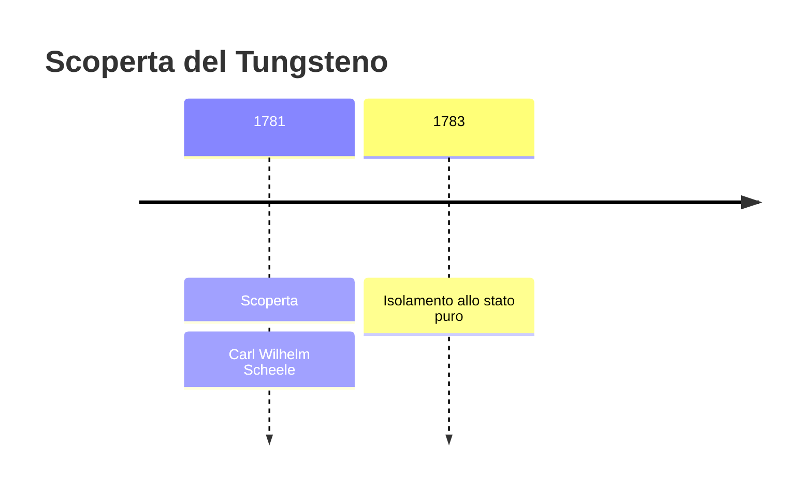
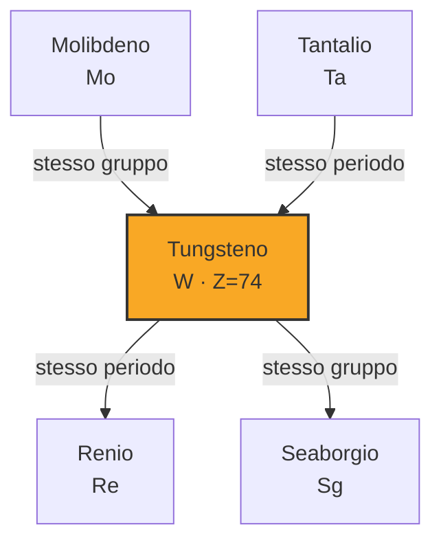

# Tungsteno (W)

> [!abstract] 30° elemento scoperto — 1781
> 

## Cronologia della scoperta

## Storia della scoperta

## Posizione nella tavola periodica

## Caratteristiche

### Dati fisico-chimici

| Proprietà | Valore |
|---|---|
| Numero atomico | 74 |
| Massa atomica | 183,841 u |
| Categoria | Metallo di transizione |
| Gruppo | 6 |
| Periodo | 6 |
| Blocco | d |
| Configurazione elettronica | [Xe] 4f¹⁴ 5d⁴ 6s² |
| Punto di fusione | 3421,9 °C |
| Punto di ebollizione | 5929,9 °C |
| Densità | 19,25 g/cm³ |
| Stati di ossidazione | — |

## Struttura atomica

![[atomo-Tungsteno.svg]]

## Usi e presenza in natura

## Nella cronologia

← Precedente: [[Molibdeno]] (1778)
→ Successivo: [[Tellurio]] (1782)

Epoca: [[Chimica pneumatica]] · Scopritore: [[Carl Wilhelm Scheele]]

## Fonti

