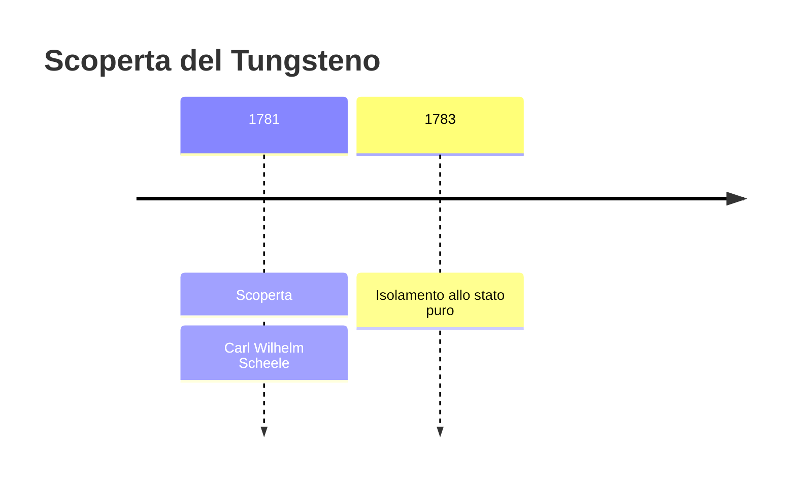
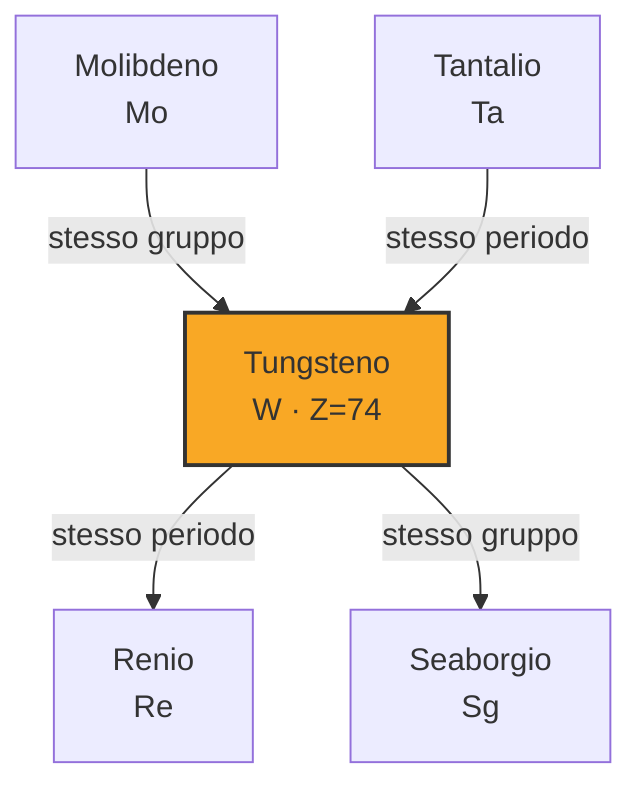
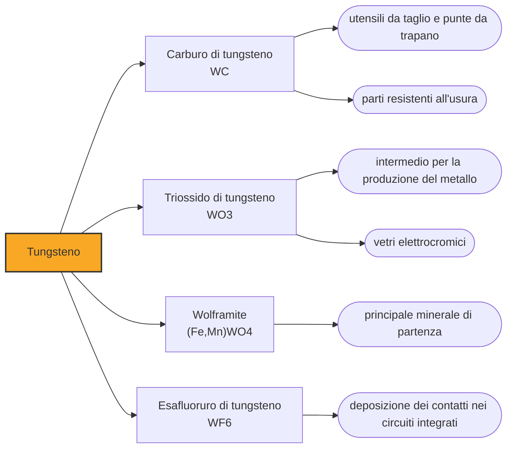

# Tungsteno (W)

> [!abstract] 30° elemento scoperto — 1781
> Nessun metallo resiste al fuoco quanto lui: bisogna arrivare a 3422 gradi per farlo colare. È la ragione per cui, per un secolo, la luce elettrica del mondo è passata attraverso un suo filamento.

Il tungsteno è il metallo che fonde più in alto di tutti e, dopo il carbonio, l'elemento più refrattario che si conosca. Pesa quasi quanto l'oro, ha due nomi in circolazione e un simbolo, W, che non corrisponde a nessuno dei due che l'italiano usa: tre anomalie che si spiegano tutte con la storia della sua scoperta, avvenuta in due paesi diversi a distanza di due anni.

## Cronologia della scoperta

## Storia della scoperta

Il primo nome è un insulto dei minatori. Nelle miniere di stagno della Sassonia e della Boemia compariva un minerale scuro e pesante che si accompagnava alla cassiterite e che, in fusione, faceva sparire una parte dello stagno nelle scorie: rendeva magra la colata. Chi lo malediceva diceva che divorava lo stagno come un lupo divora la pecora, e da lì wolfram, che si è letto come schiuma di lupo. Il minerale porta ancora quel nome, wolframite.

Il secondo nome nasce invece da una constatazione neutra. In Svezia si conosceva un altro minerale, bianco e sorprendentemente denso, che i minatori chiamavano tung sten, cioè pietra pesante: nient'altro che la descrizione di ciò che si sentiva prendendolo in mano. Quel minerale è oggi la scheelite, e i due nomi rivali del metallo — tungsteno e wolframio — vengono da due minerali diversi, l'uno svedese e l'altro tedesco.

Nel 1781 Carl Wilhelm Scheele prende in mano la pietra pesante e ne cava quel che sa cavare meglio: un acido. Trattandola scopre che contiene calce combinata con un acido bianco fino ad allora sconosciuto, l'acido tungstico, e afferma che in quell'acido sta il radicale di un metallo nuovo. Ancora una volta arriva al confine dell'elemento e si ferma: l'acido non lo riduce, perché servirebbe una fornace che non ha.

A chiudere la partita sono due fratelli baschi che avevano appena fatto il giro dei laboratori d'Europa per imparare la chimica delle miniere. Juan José e Fausto Elhuyar lavorano nel laboratorio della Reale Società Bascongada, a Bergara, e prendono la strada del minerale tedesco: dalla wolframite estraggono un acido che riconoscono identico a quello svedese di Scheele, e il 28 settembre 1783 lo riducono con il carbone ottenendo il metallo. Lo chiamano volfram.

Il risultato ha un primato che la Spagna rivendica ancora: è l'unico elemento chimico scoperto sul suolo spagnolo. Fausto avrebbe poi diretto l'insegnamento minerario del paese e sarebbe finito in Messico a governare le miniere della corona; Juan José morì a poco più di quarant'anni in Colombia, mandato anche lui a occuparsi di miniere. La chimica del Settecento e l'amministrazione degli imperi coloniali erano, molto spesso, lo stesso mestiere.

Da allora il metallo vive con un'identità doppia, decisa dalla geografia. Il mondo di lingua inglese e francese lo chiama tungsteno dal minerale svedese, quello di lingua tedesca e spagnola wolframio dal minerale tedesco, e l'italiano usa correntemente il primo pur avendo in vocabolario anche il secondo. Il simbolo W, fissato per via internazionale, viene da wolfram: sulla tavola periodica ha vinto il lupo, nella lingua corrente la pietra pesante.

## Posizione nella tavola periodica

## Caratteristiche

Il primato del tungsteno è netto: fonde a 3422 gradi, il punto di fusione più alto di tutti i metalli e di tutti gli elementi che passano davvero per lo stato liquido, e bolle intorno ai 5900, in testa o quasi anche in questa classifica, dove se la gioca con il renio. La ragione sta nella forza con cui i suoi atomi si tengono, che si traduce anche in una durezza notevole e in una velocità di evaporazione bassissima anche quando è arroventato. Alla temperatura a cui l'acciaio è già vapore, il tungsteno è ancora un solido che regge il proprio peso.

La seconda proprietà che lo rende speciale è la densità. Con poco più di 19 grammi per centimetro cubo sta alla pari con l'oro e con l'uranio, il che significa che un blocco che sembra fatto per stare in tasca ne pesa quasi il doppio del previsto. Da questa densità dipendono impieghi che nessun altro materiale economico consente: contrappesi piccoli e pesanti, schermature contro le radiazioni e proiettili perforanti.

C'è poi una curiosità biologica che riguarda il vicino di casella. Il tungsteno sta nella stessa colonna del molibdeno e gli somiglia abbastanza da poterne prendere il posto: alcuni archei e batteri che vivono nelle sorgenti calde usano enzimi costruiti attorno a un atomo di tungsteno invece che di molibdeno. È l'elemento più pesante di cui si conosca un ruolo biologico, e lo si trova esattamente dove ci si aspetterebbe che serva la resistenza al calore.

### Dati fisico-chimici

| Proprietà | Valore |
|---|---|
| Numero atomico | 74 |
| Massa atomica | 183,841 u |
| Categoria | Metallo di transizione |
| Gruppo | 6 |
| Periodo | 6 |
| Blocco | d |
| Configurazione elettronica | [Xe] 4f¹⁴ 5d⁴ 6s² |
| Punto di fusione | 3421,9 °C |
| Punto di ebollizione | 5929,9 °C |
| Densità | 19,25 g/cm³ |
| Stati di ossidazione | -2, -1, 0, +1, +2, +3, +4, +5, +6 |

## Struttura atomica

![[atomo-Tungsteno.svg]]

## Usi e presenza in natura

L'impiego che assorbe la quota maggiore della produzione non è il metallo puro ma il suo carburo, una sostanza durissima che si avvicina al diamante e che, cementata con un legante metallico, forma i taglienti degli utensili e le punte da trapano per roccia e per metallo. Ogni officina meccanica del mondo lavora, letteralmente, grazie al tungsteno; il resto va in leghe resistenti al calore, elettrodi da saldatura e contatti elettrici.

L'uso che gli ha dato fama è invece in ritirata. Per gran parte del Novecento la luce elettrica è venuta da un filamento di tungsteno arrotolato a spirale e portato all'incandescenza, l'unico materiale capace di stare a quelle temperature senza fondere né evaporare in fretta. Le lampade a risparmio energetico e i diodi hanno svuotato quel mercato, ma il filamento resiste dove serve calore o luce concentrata, dai forni sottovuoto ai tubi a raggi X.

## Curiosità

Il filamento di tungsteno arrivò tardi proprio a causa del pregio del metallo: era troppo refrattario per essere lavorato. Le prime lampade usavano carbonio, poi si provò a stampare paste di tungsteno, fragili e capricciose; la soluzione la trovò William Coolidge nel 1910, scoprendo che il tungsteno lavorato a caldo per gradi diventa duttile e si lascia trafilare in fili sottilissimi. Il materiale non era cambiato: era cambiato il modo di domarlo.

La densità quasi identica a quella dell'oro fa del tungsteno il materiale preferito da chi falsifica i lingotti: un nucleo di tungsteno dentro un guscio d'oro supera la prova più immediata, quella del peso a parità di volume, che per secoli è stata la verifica di fiducia. Per questo i controlli seri non si fidano più della bilancia e usano ultrasuoni, conducibilità elettrica o raggi X, che i due metalli non riescono a confondere.

## Nella cronologia

← Precedente: [[Molibdeno]] (1778)
→ Successivo: [[Tellurio]] (1782)

Epoca: [[Chimica pneumatica]] · Scopritore: [[Carl Wilhelm Scheele]]

## Fonti

- [Tungsten](https://en.wikipedia.org/wiki/Tungsten) — consultata il 07/09/2026
- [The d'Elhuyar brothers: the discovery and isolation of tungsten](https://institutoeuropadelospueblos.org/en/2024/04/10/the-delhuyar-brothers-the-discovery-and-isolation-of-tungsten/) — consultata il 07/09/2026
- [Juan José Elhuyar](https://en.wikipedia.org/wiki/Juan_Jos%C3%A9_Elhuyar) — consultata il 07/09/2026
- [Scheelite](https://en.wikipedia.org/wiki/Scheelite) — consultata il 07/09/2026
