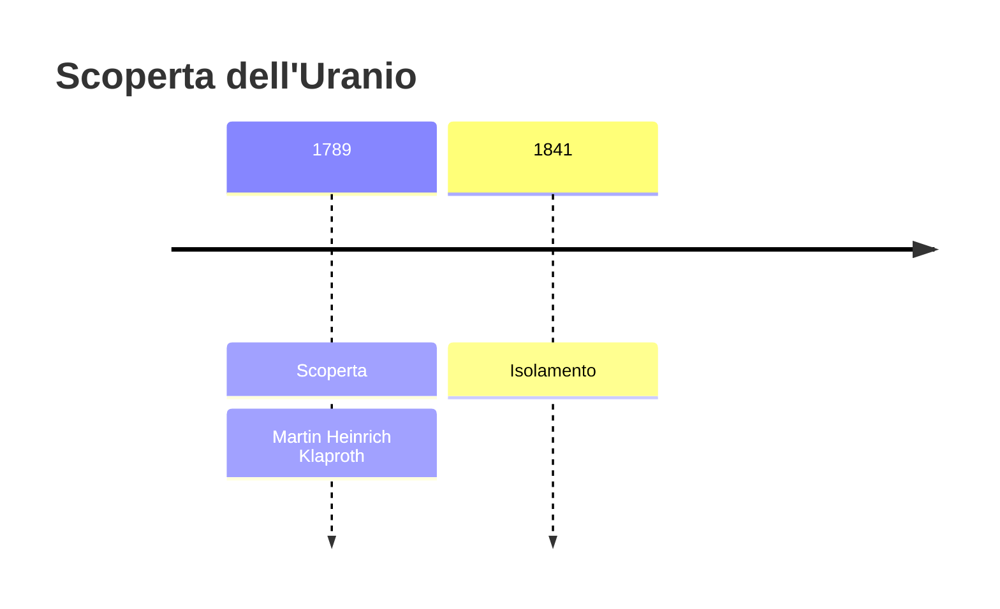
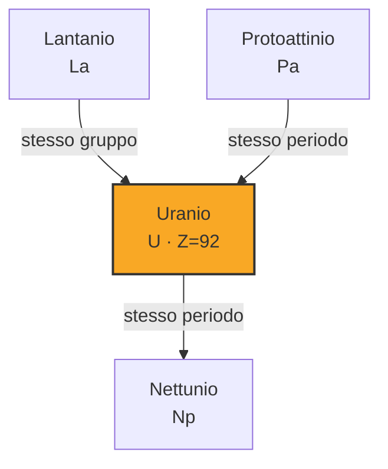
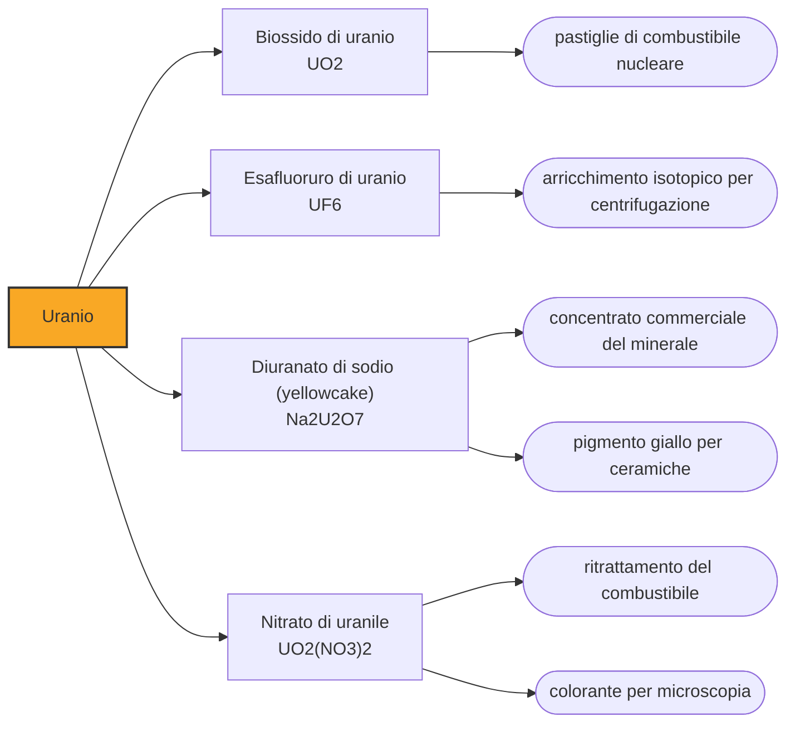

# Uranio (U)

> [!abstract] 34° elemento scoperto — 1789
> Prese il nome da un pianeta scoperto otto anni prima, quando sembrava la più innocua delle novità: un metallo pesante buono a colorare il vetro di giallo. Nessun elemento ha ingannato altrettanto sul proprio conto.

L'uranio è l'elemento più pesante che si trovi in quantità apprezzabili in natura, e uno dei più densi in assoluto: un litro pesa diciannove chili, quanto l'oro e quanto il tungsteno. Per un secolo dalla scoperta fu considerato una curiosità da vetrai e ceramisti, poi si scoprì che i suoi atomi si disfano da soli, e in cinquant'anni è diventato la sostanza politicamente più sorvegliata del pianeta.

## Cronologia della scoperta

## Storia della scoperta

Tutto comincia da un minerale che i minatori consideravano una iattura. Nelle miniere d'argento dei monti Metalliferi, al confine fra Sassonia e Boemia, compariva una roccia nera, pesante e lucida come pece, che annunciava la fine della vena d'argento e non dava nulla in cambio: la chiamavano Pechblende, dove Blende indica appunto un minerale che inganna. La si scartava sui cumuli di sterile.

Nel 1789, nella sua farmacia berlinese, Martin Heinrich Klaproth mette quella pece sotto analisi. L'opinione corrente la dava per un minerale di zinco e ferro; lui la scioglie in acido nitrico, neutralizza la soluzione e ottiene un precipitato giallo che nessun reattivo noto riesce a ricondurre a una sostanza già descritta. È un elemento nuovo, e arriva nello stesso anno in cui lo zircone gli consegna la zirconia: due scoperte in dodici mesi, entrambe frutto dello stesso ostinato far tornare i conti.

Per il nome, Klaproth guarda in alto. Otto anni prima William Herschel aveva individuato con il telescopio un pianeta oltre Saturno, il primo aggiunto al sistema solare da quando l'umanità osserva il cielo, e battezzato Urano: l'evento astronomico più clamoroso del secolo. Klaproth dedica al pianeta l'elemento, inaugurando una consuetudine che avrebbe poi dato il nettunio e il plutonio, ordinati nella tavola periodica come i loro pianeti nel cielo.

Ciò che Klaproth ottenne, però, non era l'uranio. Scaldando il composto giallo con il carbone ricavò una polvere nera dall'aspetto metallico e la prese per il metallo puro; era un ossido, e nessuno se ne accorse per mezzo secolo. L'errore è comprensibile e istruttivo: l'uranio tiene l'ossigeno con una forza che il carbone di un forno settecentesco non riesce a vincere, e l'aspetto, in chimica, non è mai una prova.

A correggere il conto è nel 1841 il francese Eugène-Melchior Péligot, che dimostra la natura di ossido della polvere di Klaproth e ottiene per la prima volta il metallo vero, riducendo il tetracloruro di uranio con il potassio. Il risultato interessa pochissime persone: l'uranio resta una rarità da gabinetto chimico, e il suo unico mestiere è tingere di giallo-verde vetri e smalti ceramici, un uso che il vetro boemo pratica da prima ancora che l'elemento avesse un nome.

Il vero significato dell'uranio si rivela per caso, nel 1896, quando Henri Becquerel lascia un sale di uranio sopra lastre fotografiche accuratamente avvolte e le trova impressionate. Nessuna luce era entrata: era il sale a emettere qualcosa per conto proprio, senza essere stato illuminato, riscaldato o toccato. È la scoperta della radioattività, e l'uranio smette di essere un pigmento per diventare la porta d'accesso alla fisica del nucleo. Ciò che ne segue — i Curie, la fissione, i reattori e le bombe — è un'altra storia, e comincia tutta lì.

## Posizione nella tavola periodica

## Caratteristiche

L'uranio naturale non è una sostanza sola ma una miscela di isotopi, e la differenza fra loro decide tutto. Oltre il novantanove per cento è uranio-238, che non sostiene una reazione a catena; appena lo 0,7 per cento è uranio-235, l'unico nuclide fissile presente in natura, cioè l'unico che spaccandosi con un neutrone lento ne libera altri capaci di proseguire. Tutta la tecnologia nucleare consiste, in fondo, nel separare o nel non separare quello 0,7 per cento.

La radioattività dell'uranio è intensa quanto basta a essere misurata e lenta quanto basta a essere ancora qui. L'uranio-238 impiega circa quattro miliardi e mezzo di anni a dimezzarsi, sicché da quando la Terra si è formata ne è decaduta all'incirca la metà: è la ragione per cui il pianeta ne contiene ancora. Decadendo genera una catena di elementi via via più leggeri — fra cui il radio e il radon — che finisce nel piombo. Il calore prodotto da questi decadimenti nelle rocce è una delle ragioni per cui l'interno della Terra è ancora caldo.

Sul piano chimico l'uranio è un metallo assai più vivace di quanto la sua aria da monolite suggerisca: si ossida all'aria annerendosi, in polvere fine prende fuoco da solo, e in soluzione forma con l'ossigeno lo ione uranile, giallo e fluorescente, che governa il suo comportamento nelle acque e nei processi di estrazione. Ed è tossico come metallo pesante indipendentemente dalla radioattività: il danno ai reni arriva prima di quello da radiazione.

### Dati fisico-chimici

| Proprietà | Valore |
|---|---|
| Numero atomico | 92 |
| Massa atomica | 238,028913 u |
| Categoria | Attinide |
| Gruppo | 3 |
| Periodo | 7 |
| Blocco | f |
| Configurazione elettronica | [Rn] 5f³ 6d¹ 7s² |
| Punto di fusione | 1132,2 °C |
| Punto di ebollizione | 4130,9 °C |
| Densità | 19,1 g/cm³ |
| Stati di ossidazione | +1, +2, +3, +4, +5, +6 |

## Struttura atomica

![[atomo-Uranio.svg]]

## Usi e presenza in natura

L'uso che assorbe quasi tutta la produzione mondiale è la generazione di energia elettrica. Il minerale viene concentrato in una polvere gialla, convertito in esafluoruro gassoso, arricchito in uranio-235 fino a qualche punto percentuale e infine trasformato in pastiglie di ossido che si impilano dentro le guaine di lega di zirconio: da lì il calore della fissione fa vapore, e il vapore muove una turbina come in qualunque altra centrale termica. I principali produttori di minerale sono oggi il Kazakistan, il Canada e la Namibia.

L'arricchimento lascia dietro di sé molto più scarto che prodotto, e quello scarto ha una vita propria. L'uranio impoverito, privato di gran parte dell'uranio-235 e quindi meno radioattivo del naturale, resta densissimo ed economico: se ne fanno contrappesi per aerei, schermature contro le radiazioni e munizioni perforanti, queste ultime al centro di una lunga controversia per la tossicità delle polveri che lasciano sul terreno.

## Curiosità

Due miliardi di anni fa la Terra fece funzionare dei reattori nucleari senza che nessuno li progettasse. A Oklo, in Gabon, i geologi hanno trovato giacimenti in cui la composizione isotopica dell'uranio è anomala e sono presenti i prodotti tipici della fissione: allora l'uranio-235 era molto più abbondante di oggi, e l'acqua che filtrava fra le rocce bastò a moderare i neutroni e ad accendere reazioni a catena, andate avanti a intermittenza per centinaia di migliaia di anni.

Il vetro all'uranio è il souvenir più diffuso dell'epoca in cui l'elemento era innocente. Prodotto in grande quantità fra Ottocento e primo Novecento per servizi da tavola e paralumi, contiene qualche punto percentuale di ossido di uranio e ha la proprietà di brillare di un verde acceso sotto la luce ultravioletta. È debolmente radioattivo e considerato innocuo da tenere in casa; i collezionisti lo cercano proprio per quel bagliore, e la produzione cessò quando l'uranio divenne materiale strategico.

## Nella cronologia

← Precedente: [[Zirconio]] (1789)
→ Successivo: [[Stronzio]] (1790)

Epoca: [[Chimica pneumatica]] · Scopritore: [[Martin Heinrich Klaproth]]

## Fonti

- [Uranium](https://en.wikipedia.org/wiki/Uranium) — consultata il 07/09/2026
- [Martin Heinrich Klaproth](https://en.wikipedia.org/wiki/Martin_Heinrich_Klaproth) — consultata il 07/09/2026
- [Natural nuclear fission reactor (Oklo)](https://en.wikipedia.org/wiki/Natural_nuclear_fission_reactor) — consultata il 07/09/2026
- [World Uranium Mining Production (World Nuclear Association)](https://world-nuclear.org/information-library/nuclear-fuel-cycle/mining-of-uranium/world-uranium-mining-production) — consultata il 07/09/2026
