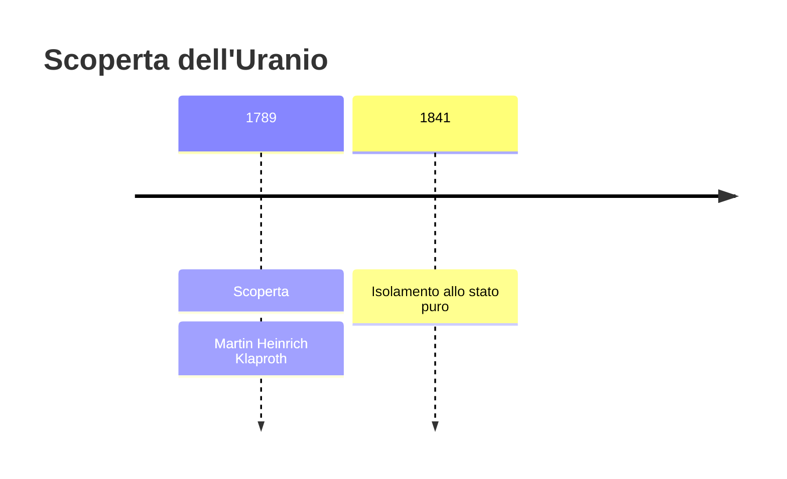
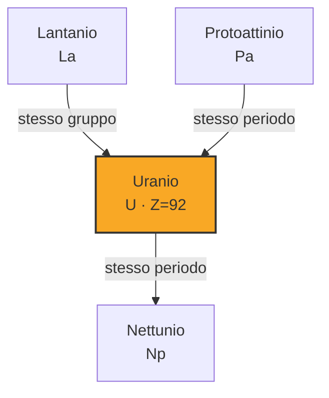

# Uranio (U)

> [!abstract] 34° elemento scoperto — 1789
> 

## Cronologia della scoperta

## Storia della scoperta

## Posizione nella tavola periodica

## Caratteristiche

### Dati fisico-chimici

| Proprietà | Valore |
|---|---|
| Numero atomico | 92 |
| Massa atomica | 238,028913 u |
| Categoria | Attinide |
| Gruppo | 3 |
| Periodo | 7 |
| Blocco | f |
| Configurazione elettronica | [Rn] 5f³ 6d¹ 7s² |
| Punto di fusione | 1132,2 °C |
| Punto di ebollizione | 4130,9 °C |
| Densità | 19,1 g/cm³ |
| Stati di ossidazione | — |

## Struttura atomica

![[atomo-Uranio.svg]]

## Usi e presenza in natura

## Nella cronologia

← Precedente: [[Zirconio]] (1789)
→ Successivo: [[Stronzio]] (1790)

Epoca: [[Chimica pneumatica]] · Scopritore: [[Martin Heinrich Klaproth]]

## Fonti

