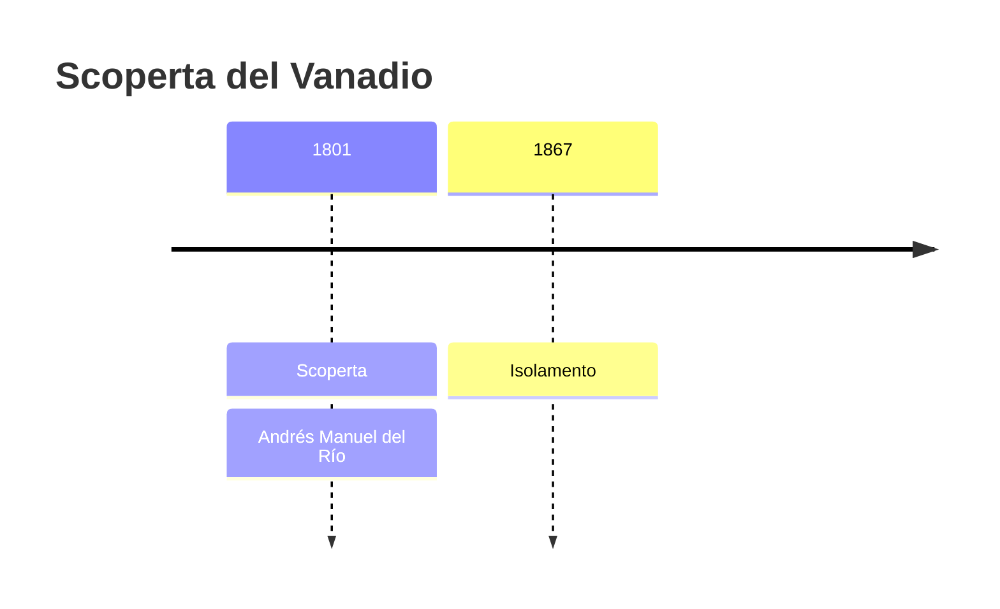
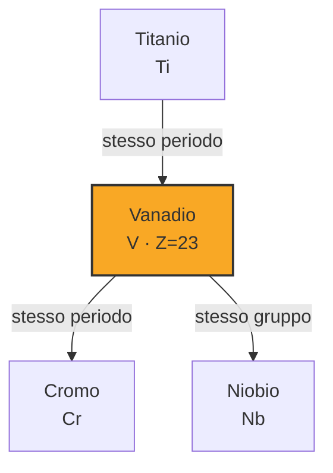

# Vanadio (V)

> [!abstract] 40° elemento scoperto — 1801
> 

## Cronologia della scoperta

## Storia della scoperta

## Posizione nella tavola periodica

## Caratteristiche

### Dati fisico-chimici

| Proprietà | Valore |
|---|---|
| Numero atomico | 23 |
| Massa atomica | 50,94151 u |
| Categoria | Metallo di transizione |
| Gruppo | 5 |
| Periodo | 4 |
| Blocco | d |
| Configurazione elettronica | [Ar] 3d³ 4s² |
| Punto di fusione | 1909,9 °C |
| Punto di ebollizione | 3406,9 °C |
| Densità | 6,0 g/cm³ |
| Stati di ossidazione | — |

## Struttura atomica

![[atomo-Vanadio.svg]]

## Usi e presenza in natura

## Nella cronologia

← Precedente: [[Berillio]] (1798)
→ Successivo: [[Niobio]] (1801)

Epoca: [[L'età dell'elettrolisi]] · Scopritore: [[Andrés Manuel del Río]]

## Fonti

