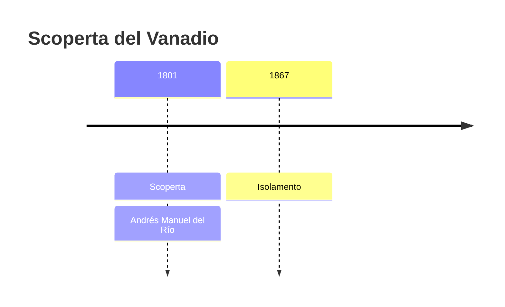
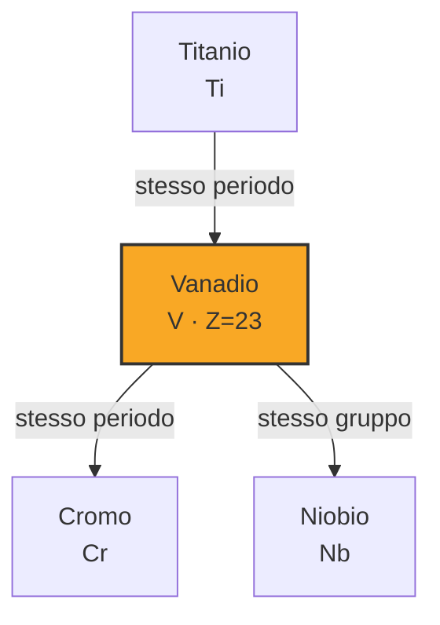
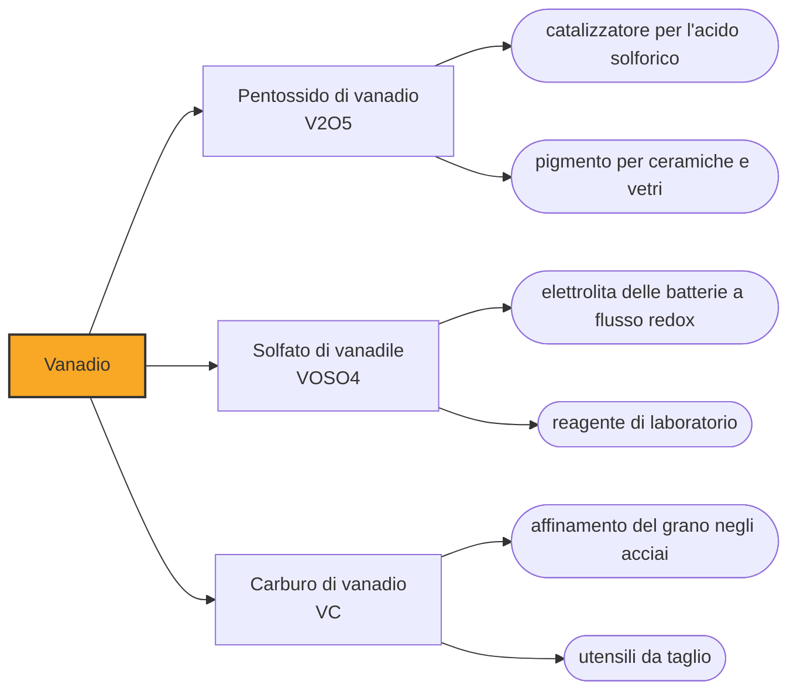

# Vanadio (V)

> [!abstract] 40° elemento scoperto — 1801
> Nel 1801 un mineralogista trovò a Città del Messico un elemento nuovo. Quattro anni dopo un chimico di Parigi gli scrisse che si era sbagliato, e lui gli credette: per rimediare a quella parola ci vollero trent'anni.

Il vanadio è un metallo grigio con un riflesso azzurro, duro e abbastanza duttile da lasciarsi laminare, e deve la propria fama a due cose lontane fra loro: tiene insieme buona parte degli acciai da utensile del mondo e forma composti di ogni colore, dal violetto al giallo.

## Cronologia della scoperta

## Storia della scoperta

Nel 1801 Andrés Manuel del Río insegnava mineralogia al Real Seminario de Minería di Città del Messico, la prima scuola mineraria del continente americano. Analizzando un minerale di piombo che i minatori chiamavano «piombo bruno» — lo stesso che molto più tardi sarebbe stato battezzato vanadinite — ne ricavò sali di colori diversissimi e concluse di avere in mano un elemento sconosciuto: lo chiamò panchromium, «tutti i colori», e poi eritronio, perché scaldati quei sali viravano al rosso.

Alcuni campioni presero la via dell'Europa, e nel 1805 il chimico francese Hippolyte Victor Collet-Descotils li esaminò e sentenziò che si trattava di cromo impuro. Il verdetto era sbagliato, ma veniva dal centro della chimica europea ed era condiviso da Alexander von Humboldt, che di del Río era amico dai tempi degli studi a Freiberg. Del Río lo accettò e ritirò la propria rivendicazione.

L'elemento tornò da un'altra strada, e per un motivo pratico. Nel 1830 Nils Gabriel Sefström, che dirigeva la scuola mineraria di Falun, cercava di capire perché certe ghise fossero più fragili di altre, e nel minerale di ferro della miniera di Taberg, in Småland, trovò tracce di un metallo che non sapeva riconoscere. Ne accumulò ossido a sufficienza per portarlo a Stoccolma, nel laboratorio privato di Jöns Jacob Berzelius: ci lavorarono durante le feste di Natale e ai primi di gennaio del 1831 avevano il campione. Sefström lo chiamò vanadio, da Vanadís, uno dei nomi della dea nordica Freyja, per i colori dei suoi sali.

Che si trattasse dell'eritronio di del Río lo dimostrò nello stesso 1831 Friedrich Wöhler, che aveva sotto mano i minerali messicani e riconobbe l'identità delle due sostanze. Il nome però era ormai dato: la proposta del geologo George William Featherstonhaugh di chiamarlo «rionio», in onore di chi lo aveva incontrato per primo, non ebbe seguito.

A chi vada la scoperta resta una questione di definizioni. Le tavole riportano il 1801 e il nome di del Río, ed è la scelta che quasi tutte le fonti seguono; ma il vanadio entra nella chimica europea solo nel 1830, con un'analisi che nessuno ha ritirato, e chi aveva ritrattato non era stato smentito da un esperimento, bensì convinto da un'autorità.

Il metallo vero e proprio arrivò molto più tardi. Nel 1867 Henry Enfield Roscoe, all'Owens College di Manchester, ottenne vanadio puro riducendo con idrogeno il cloruro di vanadio, e mostrò che ciò che fino ad allora era passato per il metallo — a partire dal preparato di Berzelius — era in realtà il nitruro. Dovette correggere di conseguenza anche la massa atomica dell'elemento.

## Posizione nella tavola periodica

## Caratteristiche

Il vanadio fonde a 1910 gradi e resiste bene alla corrosione: a temperatura ambiente si copre di uno strato di ossido che lo protegge, e non lo intaccano gli alcali né l'acido solforico o cloridrico. Sopra i 660 gradi, invece, l'ossidazione all'aria diventa rapida.

In soluzione acquosa il vanadio esiste in quattro stati di ossidazione contigui, dal +2 al +5, e ciascuno ha il proprio colore: violetto, verde, blu e giallo. Riducendo un vanadato con zinco si vede la soluzione attraversare i quattro colori uno dopo l'altro, ed è a questa tavolozza che l'elemento deve il nome. La tabella ne elenca altri, fino al -3, ma appartengono ai carbonili di laboratorio, dove il vanadio sta a valenza zero o negativa.

In natura non si trova mai libero. I minerali che ne sono ricchi — vanadinite, patronite, carnotite — hanno avuto importanza commerciale in passato, ma oggi quasi tutto il vanadio esce come sottoprodotto: dalle scorie delle magnetiti titanifere lavorate per il ferro, dai residui del petrolio, dai catalizzatori esausti. Nel 2025 la Cina ne ha prodotte 82.000 tonnellate sulle 110.000 mondiali stimate dallo USGS, seguita a distanza dalla Russia con 21.000 e poi da Brasile e Sudafrica, intorno alle cinquemila ciascuno; negli Stati Uniti l'estrazione primaria è ferma dal 2020.

### Dati fisico-chimici

| Proprietà | Valore |
|---|---|
| Numero atomico | 23 |
| Massa atomica | 50,94151 u |
| Categoria | Metallo di transizione |
| Gruppo | 5 |
| Periodo | 4 |
| Blocco | d |
| Configurazione elettronica | [Ar] 3d³ 4s² |
| Punto di fusione | 1909,9 °C |
| Punto di ebollizione | 3406,9 °C |
| Densità | 6,0 g/cm³ |
| Stati di ossidazione | -3, -1, 0, +1, +2, +3, +4, +5 |

## Struttura atomica

![[atomo-Vanadio.svg]]

## Usi e presenza in natura

Oltre l'ottanta per cento del vanadio prodotto finisce in acciai e ferroleghe. Bastano frazioni di punto percentuale di ferrovanadio per ottenere acciai da utensile che tengono il filo anche a caldo e acciai basso-legati ad alta resistenza per tubazioni e strutture; il primo impiego industriale su larga scala fu il telaio della Ford Model T, intorno al 1905, più leggero a parità di robustezza.

Il resto si divide fra due impieghi molto diversi. Nelle leghe di titanio per l'aeronautica il vanadio è il secondo elemento aggiunto dopo l'alluminio, e per quell'uso lo USGS non registra sostituti accettabili; il pentossido di vanadio, invece, è il catalizzatore con cui si ossida l'anidride solforosa nel processo che produce acido solforico.

## Curiosità

Le batterie a flusso redox al vanadio sfruttano proprio i quattro stati contigui: la coppia +5/+4 sta a un elettrodo, la +3/+2 all'altro, e siccome l'elemento è lo stesso da entrambe le parti le contaminazioni fra i due liquidi non rovinano la cella. Si usano per accumulare energia sulla rete elettrica, dove contano la durata e la sicurezza più della leggerezza.

Alcune ascidie, animali marini che filtrano l'acqua, accumulano vanadio in cellule del sangue chiamate vanadociti, dove la concentrazione arriva a milioni di volte quella dell'acqua circostante; a che cosa serva non è ancora chiaro.

## Nella cronologia

← Precedente: [[Berillio]] (1798)
→ Successivo: [[Niobio]] (1801)

Epoca: [[L'età dell'elettrolisi]] · Scopritore: [[Andrés Manuel del Río]]

## Fonti

- [Vanadium](https://en.wikipedia.org/wiki/Vanadium) — consultata il 08/09/2026
- [Vanadium — Royal Society of Chemistry](https://periodic-table.rsc.org/element/23/vanadium) — consultata il 08/09/2026
- [USGS Mineral Commodity Summaries 2026 — Vanadium](https://pubs.usgs.gov/periodicals/mcs2026/mcs2026-vanadium.pdf) — consultata il 08/09/2026
- [Nils Gabriel Sefström](https://en.wikipedia.org/wiki/Nils_Gabriel_Sefstr%C3%B6m) — consultata il 08/09/2026
- [Sir Henry Enfield Roscoe](https://en.wikipedia.org/wiki/Henry_Roscoe_%28chemist%29) — consultata il 08/09/2026
