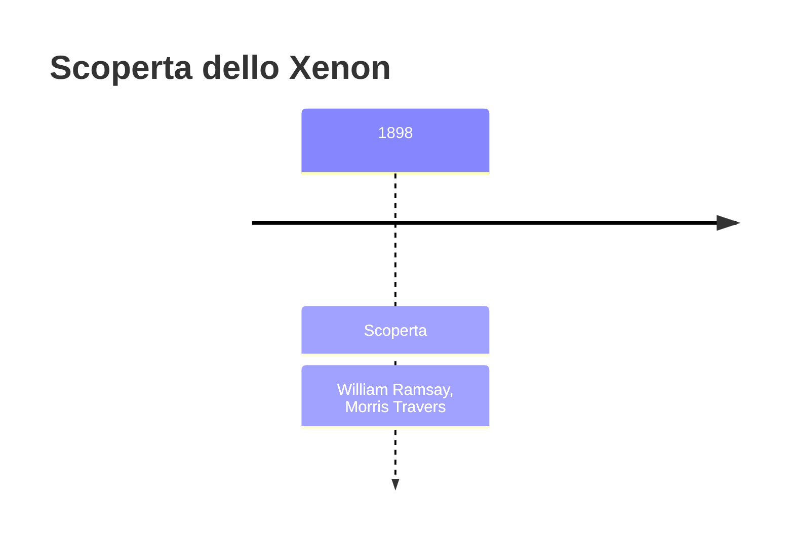
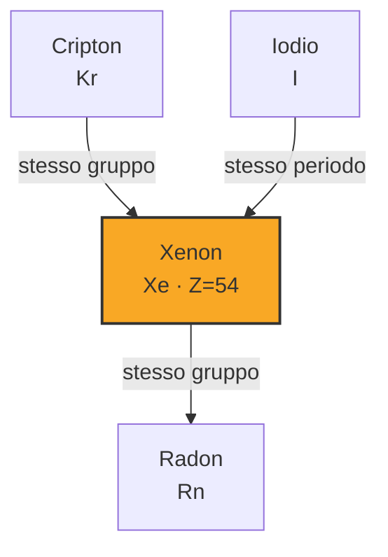

# Xenon (Xe)

> [!abstract] 79° elemento scoperto — 1898
> 

## Cronologia della scoperta

## Storia della scoperta

## Posizione nella tavola periodica

## Caratteristiche

### Dati fisico-chimici

| Proprietà | Valore |
|---|---|
| Numero atomico | 54 |
| Massa atomica | 131,2936 u |
| Categoria | Gas nobile |
| Gruppo | 18 |
| Periodo | 5 |
| Blocco | p |
| Configurazione elettronica | [Kr] 4d¹⁰ 5s² 5p⁶ |
| Punto di fusione | -111,8 °C |
| Punto di ebollizione | -108,1 °C |
| Densità | 5,894 g/cm³ |
| Stati di ossidazione | — |

## Struttura atomica

![[atomo-Xenon.svg]]

## Usi e presenza in natura

## Nella cronologia

← Precedente: [[Cripton]] (1898)
→ Successivo: [[Polonio]] (1898)

Epoca: [[Spettroscopia e radioattività]] · Scopritori: [[William Ramsay]], [[Morris Travers]]

## Fonti

