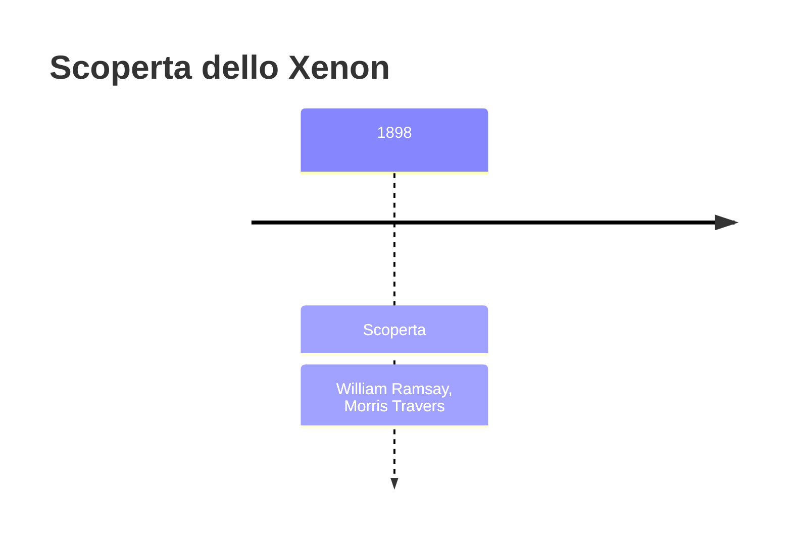
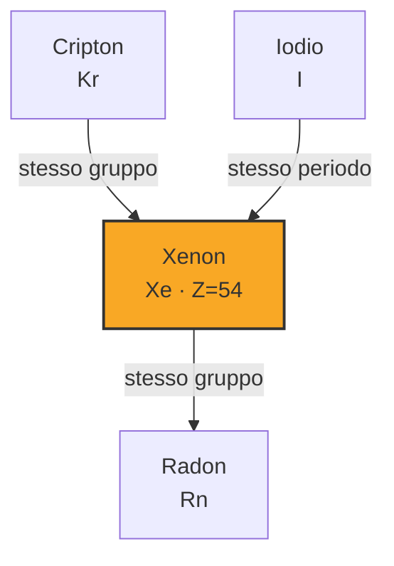
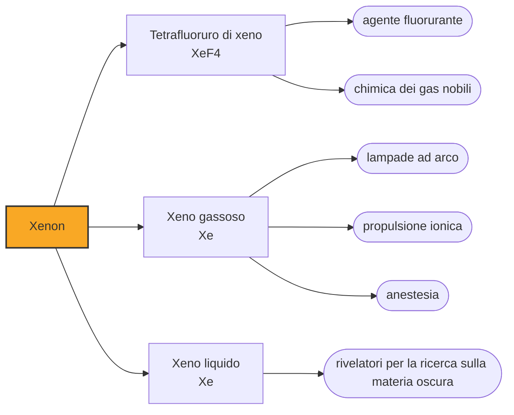

# Xenon (Xe)

> [!abstract] 79° elemento scoperto — 1898
> Per sessantaquattro anni i gas nobili furono, per definizione, gli elementi che non fanno composti. Il 23 marzo 1962 un chimico di Vancouver mischiò due gas e la definizione cadde.

Lo xenon è il più pesante dei gas nobili stabili e il più reattivo: è con lui che si è dimostrato che l'inerzia dei gas nobili non era una legge di natura ma una questione di energia. È anche il più raro dei gas dell'aria, presente in una parte su undici milioni e mezzo, e per questo il più caro.

## Cronologia della scoperta

> [!info] Nota sulla cronologia
> Terzo e ultimo dei gas nobili che Ramsay e Travers ricavarono nel 1898 dall'aria liquida, isolato il 12 luglio. Nel 1962 Neil Bartlett ne preparò il primo composto, l'esafluoroplatinato di xeno, smentendo l'inerzia assoluta dei gas nobili.

## Storia della scoperta

Il 12 luglio 1898 William Ramsay e Morris Travers arrivarono in fondo alla loro distillazione dell'aria liquida: nella frazione più pesante, dopo il cripton e il neon, restava ancora un gas. Le sue righe spettrali erano nuove, e ne chiamarono xenon, dal greco xenos, «straniero», «ospite».

Trovarlo era una cosa, averne era un'altra: nell'aria lo xenon sta in una parte su undici milioni e mezzo, e per raccoglierne un litro bisogna lavorare undici milioni di litri d'aria. Per mezzo secolo restò un gas da laboratorio, interessante e inutilizzabile, e la sua chimica — cioè la sua assenza di chimica — non fu quasi studiata.

Nel 1962 Neil Bartlett, a Vancouver, stava studiando l'esafluoruro di platino, un composto talmente ossidante da strappare un elettrone perfino all'ossigeno molecolare. Notò che l'energia necessaria a ionizzare lo xenon era quasi identica a quella dell'ossigeno, e ne trasse la conseguenza: il 23 marzo mise i due gas a contatto e ottenne un solido giallo-arancio, il primo composto di un gas nobile mai preparato.

Il risultato cambiò un capitolo dei manuali nel giro di mesi. In poco tempo furono preparati fluoruri e ossidi di xenon, poi composti di cripton e infine, a temperature bassissime, perfino di argon: la colonna che si definiva per l'inerzia si rivelò una colonna di elementi molto poco reattivi, non inerti. È uno dei casi in cui una proprietà data per definitoria si è rivelata solo un limite delle condizioni sperimentali.

## Posizione nella tavola periodica

## Caratteristiche

Lo xenon forma oggi decine di composti: fluoruri, ossidi, ossifluoruri, sali complessi. La ragione per cui è il più disponibile della colonna sta nelle sue dimensioni: l'atomo è grande, gli elettroni esterni sono lontani dal nucleo e meno trattenuti, e servono meno energia e un ossidante meno estremo per strapparne uno.

È incolore e inodore, ma con una densità più di quattro volte quella dell'aria: respirandolo la voce diventa più profonda, l'opposto di quello che fa l'elio. Liquefa a 165 kelvin, e nella scarica elettrica emette una luce bianco-azzurra molto vicina, come spettro, alla luce del giorno.

È il più raro dei gas nobili non radioattivi dell'atmosfera. Si ricava come sottoprodotto dei grandi impianti di separazione dell'aria, e la produzione mondiale annua si misura in poche decine di milioni di litri: abbastanza per la medicina, l'illuminazione e i satelliti, non abbastanza per usi di massa.

### Dati fisico-chimici

| Proprietà | Valore |
|---|---|
| Numero atomico | 54 |
| Massa atomica | 131,2936 u |
| Categoria | Gas nobile |
| Gruppo | 18 |
| Periodo | 5 |
| Blocco | p |
| Configurazione elettronica | [Kr] 4d¹⁰ 5s² 5p⁶ |
| Punto di fusione | -111,8 °C |
| Punto di ebollizione | -108,1 °C |
| Densità | 5,894 g/cm³ |
| Stati di ossidazione | 0, +2, +4, +6, +8 |

## Struttura atomica

![[atomo-Xenon.svg]]

## Usi e presenza in natura

Le lampade ad arco allo xenon danno una luce continua e vicina a quella solare, e per questo hanno illuminato per decenni i proiettori cinematografici, i fari delle automobili di fascia alta, i simulatori solari con cui si collaudano i pannelli fotovoltaici e i flash professionali, dove la scarica dura pochi milionesimi di secondo.

Nei propulsori ionici dei satelliti lo xenon è il propellente di riferimento: viene ionizzato e accelerato da un campo elettrico fino a decine di chilometri al secondo, e la spinta è minuscola ma continua per anni. Le sonde che hanno raggiunto asteroidi e comete con motori elettrici hanno viaggiato spingendo via atomi di xeno, uno alla volta.

In medicina lo xenon è un anestetico generale efficace, che agisce in fretta e non pesa sul cuore e sulla circolazione: se ne fa poco uso solo perché costa troppo. Nella ricerca sulla materia oscura è invece il protagonista assoluto: rivelatori con parecchie tonnellate di xeno liquido, sepolti sotto le montagne per schermarli dai raggi cosmici, aspettano l'urto di particelle che nessuno ha ancora osservato. Lo xeno serve perché è denso, ha nuclei pesanti da colpire e si può purificare fino a livelli di radioattività residua bassissimi.

Il prezzo dello xenon è di ordini di grandezza superiore a quello dell'argon, e questo decide da solo dove lo si usa: dove ne serve poco e serve una proprietà che nessun altro elemento dà — la luce solare artificiale, la spinta continua nel vuoto, un nucleo pesante da colpire — e mai dove basterebbe qualcosa di più comune. È un vincolo che si sente anche nella ricerca: gli esperimenti sulla materia oscura competono per lo xeno disponibile con l'industria dei satelliti.

## Curiosità

Respirare xeno abbassa la voce invece di alzarla, perché il suono nel gas viaggia più lentamente che nell'aria: è l'esperimento inverso a quello dell'elio. Non è però uno scherzo consigliabile: essendo quattro volte più denso dell'aria, il gas si accumula nei polmoni e non se ne va da solo.

Prima di provare, Bartlett aveva calcolato che l'energia di ionizzazione dello xenon e quella dell'ossigeno molecolare fossero quasi uguali, e su quel numero aveva costruito la propria previsione. L'esperimento durò pochi minuti, il ragionamento che lo rendeva sensato era stato l'unica cosa difficile.

## Nella cronologia

← Precedente: [[Cripton]] (1898)
→ Successivo: [[Polonio]] (1898)

Epoca: [[Spettroscopia e radioattività]] · Scopritori: [[William Ramsay]], [[Morris Travers]]

## Fonti

- [Xenon](https://en.wikipedia.org/wiki/Xenon) — consultata il 09/09/2026
- [Xenon — Royal Society of Chemistry](https://periodic-table.rsc.org/element/54/xenon) — consultata il 09/09/2026
- [Noble gas compound](https://en.wikipedia.org/wiki/Noble_gas_compound) — consultata il 09/09/2026

---

> [!warning] Avvertenza
> Questo progetto è stato realizzato con l'assistenza di sistemi di
> intelligenza artificiale. I contenuti sono verificati sulle fonti citate,
> ma **possono contenere errori e imprecisioni**: prima di riutilizzarli,
> controlla la fonte.
