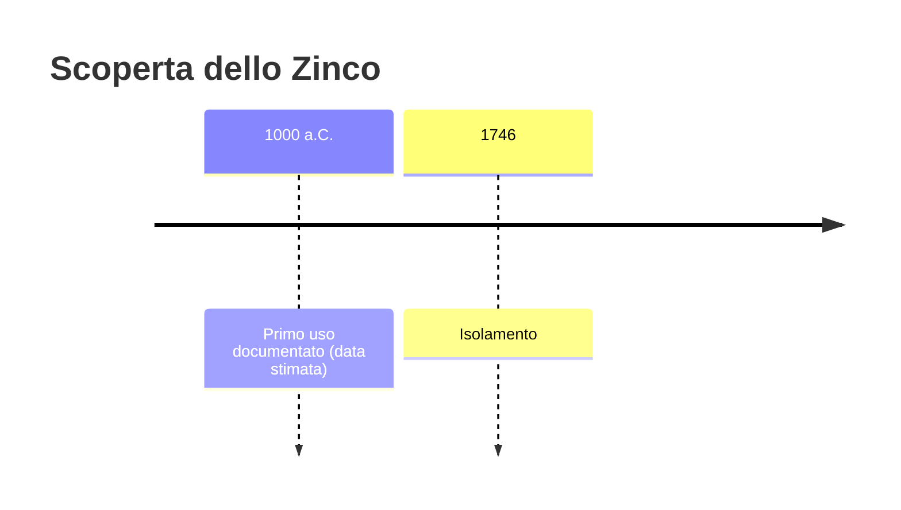
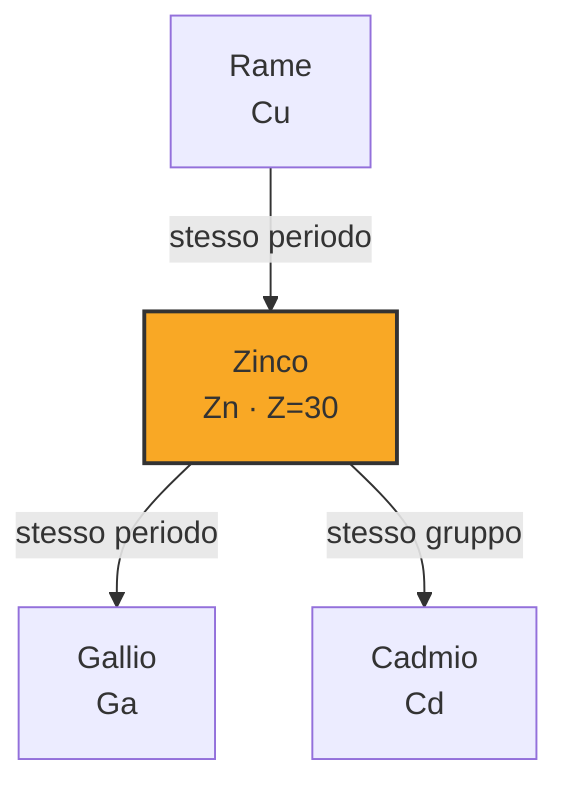
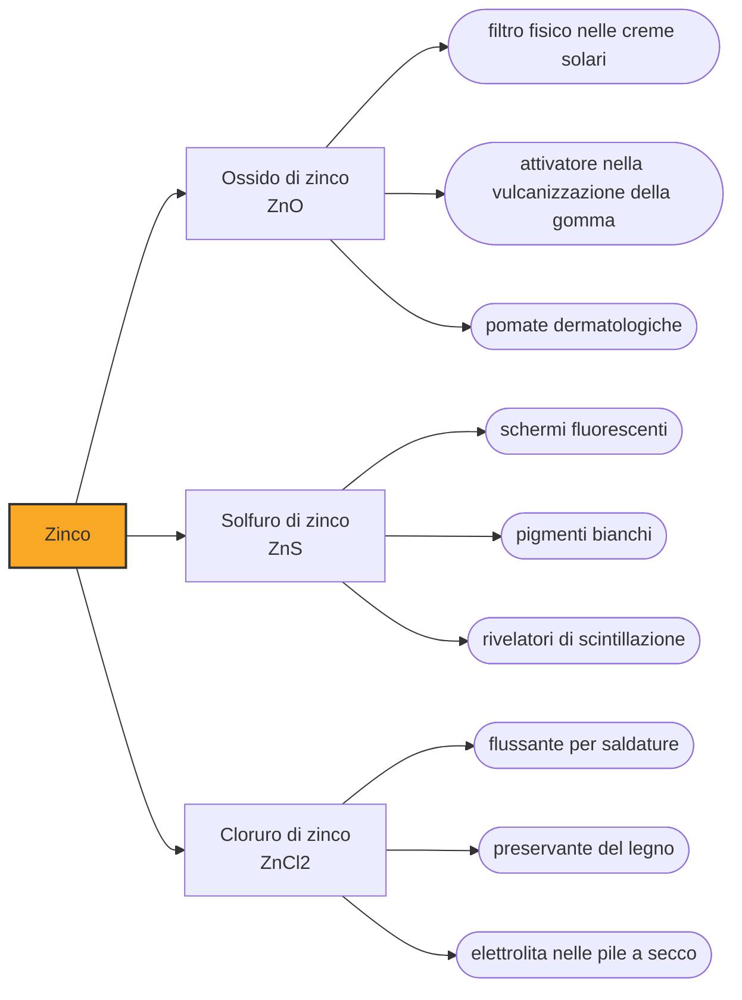

# Zinco (Zn)

> [!abstract] 11° elemento scoperto — 1000 a.C.
> Per tremila anni l'Europa ha fabbricato ottone senza mai vedere lo zinco. Non era ignoranza: era che lo zinco, se provi a fonderlo come gli altri metalli, evapora e sparisce prima ancora di formarsi.

Lo zinco è un metallo bianco-azzurrino di uso quotidiano, e la sua storia è dominata da un paradosso: se ne conoscevano e sfruttavano le leghe molto prima che qualcuno avesse mai tenuto in mano il metallo puro. La ragione non è culturale ma fisica, e sta in un numero.

## Cronologia della scoperta

> [!info] Nota sulla cronologia
> La data convenzionale colloca lo zinco nell'area mineraria indiana del Rajasthan, dove l'attività estrattiva è documentata dalla metà del I millennio a.C. La distillazione dello zinco metallico è però più tarda; in Europa Andreas Marggraf ne pubblica l'isolamento nel 1746, quattro anni dopo la distillazione di Anton von Swab.

## Storia della scoperta

Il numero è novecentosette, i gradi a cui lo zinco bolle. Per estrarlo dal minerale bisogna scaldarlo con il carbone oltre i novecentocinquanta, cioè oltre il suo punto di ebollizione: nel momento stesso in cui il metallo si forma è già vapore, esce dal forno e a contatto con l'aria si riossida in fumo bianco. Ogni fornace normale, applicata allo zinco, produce fumo e niente altro. Per averlo bisogna condensarne il vapore al riparo dall'aria, un'idea che non viene in mente a nessuno finché non serve.

L'antichità aggira l'ostacolo senza saperlo. Nella cementazione si scaldano in un crogiolo chiuso il rame e la calamina, un minerale di zinco, insieme al carbone: il vapore di zinco che si sviluppa non ha modo di scappare e viene assorbito direttamente dal rame ancora solido. Ne esce l'ottone, giallo e lucente, senza che lo zinco metallico compaia mai. È una tecnica che i Romani padroneggiano dal I secolo a.C. e che resterà dominante fino a metà Ottocento.

Oggetti in lega di rame e zinco compaiono già nel III millennio a.C. in Asia occidentale e nel Mediterraneo orientale, e leghe con un contenuto altissimo di zinco, fra l'ottanta e il novanta per cento, sono state datate a circa duemilacinquecento anni fa. Molti dei pezzi più antichi però contengono poco zinco e nascono probabilmente dalla fusione casuale di minerali di rame naturalmente zincati: distinguere il caso dall'intenzione, in archeometallurgia, è la questione difficile.

Il metallo vero nasce in India. A Zawar, in Rajasthan, i metallurgisti risolvono il problema della condensazione con la distillazione discendente: il minerale carica piccole storte di argilla disposte a rovescio su una piastra forata, il vapore di zinco scende invece di salire e si raccoglie in recipienti sottostanti, dove condensa fuori dal contatto con l'aria. I forni koshthi, descritti anche nel trattato Rasaratna Samuccaya, operavano in batterie che ne contenevano decine ciascuna. Lo zinco puro più antico prodotto dall'uomo che si conosca viene da qui e risale al IX secolo d.C.

In Europa lo zinco arriva prima come merce che come conoscenza. Il metallo indiano e cinese comincia a essere importato intorno al 1600 e per tutto il Seicento resta un articolo d'oriente, costoso e di provenienza mal compresa. Solo nel 1738 William Champion brevetta in Inghilterra un procedimento a storte, e nel 1746 Andreas Marggraf pubblica a Berlino l'isolamento dello zinco puro; lo svedese Anton von Swab lo aveva ottenuto quattro anni prima. Fra la tecnica indiana e quella europea corrono, a essere generosi, otto secoli.

> [!warning] Questione aperta
> La data del 1000 a.C. non regge come data del metallo, e va letta per quello che è: una convenzione che segnala l'antichità dell'ottone e del distretto minerario indiano, non la produzione di zinco puro. L'archeologia di Zawar, in Rajasthan, documenta estrazione mineraria almeno dal VI secolo a.C., ma quello che se ne ricavava allora erano argento e piombo. Lo zinco metallico più antico prodotto dall'uomo che si conosca viene dallo stesso sito e risale al IX secolo d.C., mentre la fusione dello zinco su scala industriale, con le batterie di storte in argilla, sembra cominciare intorno al XII secolo. L'ottone, invece, precede tutto questo di millenni: ma l'ottone si fa senza mai vedere lo zinco.

## Posizione nella tavola periodica

## Caratteristiche

La chimica dello zinco è di una monotonia sorprendente per un metallo di transizione: praticamente tutti i suoi composti lo contengono nello stato di ossidazione più due, senza le alternative colorate tipiche dei metalli di transizione vicini. Il guscio d è completamente pieno, e questo spiega insieme la scarsa varietà di valenze e il fatto che i suoi composti siano quasi sempre bianchi o incolori invece che accesi come quelli del rame o del cobalto.

Lo zinco è un metallo moderatamente reattivo e un riducente energico: cede volentieri i suoi due elettroni esterni. È esattamente ciò che lo rende utile, perché in coppia con un metallo meno reattivo diventa il pezzo che si sacrifica. Immerso in acido reagisce con vivacità liberando idrogeno, e questa reazione da manuale è stata per due secoli il modo più semplice di produrre idrogeno in laboratorio.

### Dati fisico-chimici

| Proprietà | Valore |
|---|---|
| Numero atomico | 30 |
| Massa atomica | 65,382 u |
| Categoria | Metallo di transizione |
| Gruppo | 12 |
| Periodo | 4 |
| Blocco | d |
| Configurazione elettronica | [Ar] 3d¹⁰ 4s² |
| Punto di fusione | 419,5 °C |
| Punto di ebollizione | 906,9 °C |
| Densità | 7,14 g/cm³ |
| Stati di ossidazione | -2, 0, +1, +2 |

## Struttura atomica

![[atomo-Zinco.svg]]

## Usi e presenza in natura

Circa metà dello zinco prodotto al mondo va a proteggere il ferro. Nella zincatura l'acciaio riceve un rivestimento di zinco che lo difende in due modi: fa da barriera fisica, e quando la barriera si graffia il sacrificio continua per via elettrochimica, perché lo zinco si corrode al posto del ferro sottostante finché ce n'è. Un graffio su una lamiera zincata non arrugginisce, ed è la ragione per cui esistono guardrail, tralicci e carrozzerie che durano decenni all'aperto.

Il resto si divide fra le leghe e l'elettrochimica. L'ottone resta il grande classico per rubinetteria, strumenti musicali e minuteria, mentre le leghe da pressofusione a base di zinco producono in serie componenti di forma complicata a costo bassissimo. Lo zinco è inoltre l'anodo delle pile a secco tradizionali, dove il contenitore stesso della pila è il reagente che si consuma, e l'ossido di zinco entra in creme solari, pomate dermatologiche e gomma vulcanizzata.

## Curiosità

Dopo il ferro, lo zinco è il metallo in traccia più abbondante nel corpo umano, e compare come cofattore in tutte le classi di enzimi conosciute: sono migliaia le proteine che senza un atomo di zinco al posto giusto non funzionano. La carenza, che nel mondo in via di sviluppo riguarda una popolazione stimata in miliardi di persone, produce nei bambini ritardo della crescita e maggiore vulnerabilità alle infezioni.

La parola zincatura in inglese si dice galvanization, dal bolognese Luigi Galvani, che con lo zinco non c'entra quasi nulla: i suoi esperimenti furono sulle rane e sulla contrazione muscolare. Il collegamento passa da Alessandro Volta, che spiegò quei fenomeni con il contatto fra metalli diversi e costruì la pila proprio impilando dischi di zinco e di rame. Il nome del fisiologo è finito sul processo industriale per una catena di malintesi produttivi.

## Nella cronologia

← Precedente: [[Mercurio]] (1500 a.C.)
→ Successivo: [[Platino]] (600 a.C.)

Epoca: [[Antichità]]

## Fonti

- [Zinc](https://en.wikipedia.org/wiki/Zinc) — consultata il 07/09/2026
- [Brass (storia della cementazione e dell'ottone antico)](https://en.wikipedia.org/wiki/Brass) — consultata il 07/09/2026
- [Zawar: World's Oldest Zinc Mining and Metallurgy Site](https://geographyandyou.com/geoheritage-sites/zawar-worlds-oldest-zinc-mining-and-metallurgy-site) — consultata il 07/09/2026
- [Zinc Production in Ancient India (Infinity Foundation)](https://infinityfoundation.com/zinc-production-in-ancient-india/) — consultata il 07/09/2026

---

> [!warning] Avvertenza
> Questo progetto è stato realizzato con l'assistenza di sistemi di
> intelligenza artificiale. I contenuti sono verificati sulle fonti citate,
> ma **possono contenere errori e imprecisioni**: prima di riutilizzarli,
> controlla la fonte.
