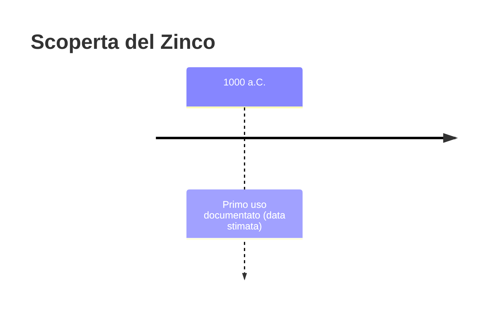
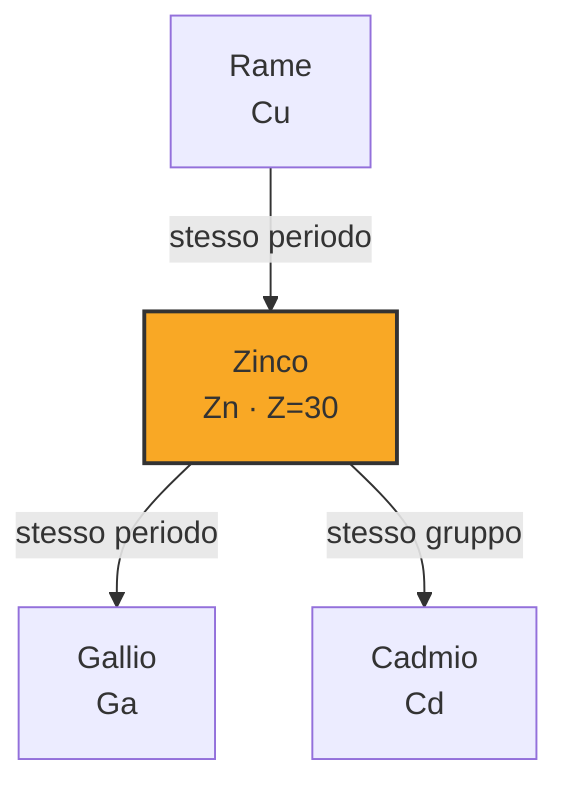

# Zinco (Zn)

> [!abstract] 11° elemento scoperto — 1000 a.C.
> 

## Cronologia della scoperta

## Storia della scoperta

## Posizione nella tavola periodica

## Caratteristiche

### Dati fisico-chimici

| Proprietà | Valore |
|---|---|
| Numero atomico | 30 |
| Massa atomica | 65,382 u |
| Categoria | Metallo di transizione |
| Gruppo | 12 |
| Periodo | 4 |
| Blocco | d |
| Configurazione elettronica | [Ar] 3d¹⁰ 4s² |
| Punto di fusione | 419,5 °C |
| Punto di ebollizione | 906,9 °C |
| Densità | 7,14 g/cm³ |
| Stati di ossidazione | — |

## Struttura atomica

![[atomo-Zinco.svg]]

## Usi e presenza in natura

## Nella cronologia

← Precedente: [[Mercurio]] (1500 a.C.)
→ Successivo: [[Platino]] (600 a.C.)

Epoca: [[Antichità]]

## Fonti

