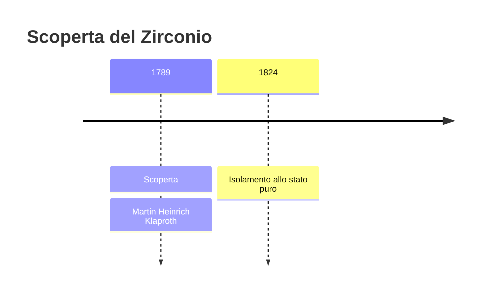
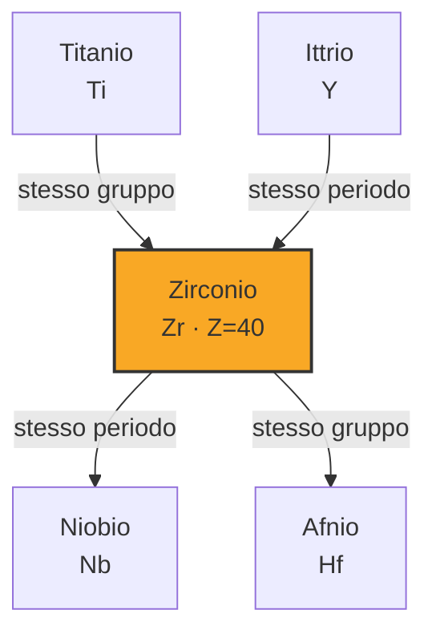

# Zirconio (Zr)

> [!abstract] 33° elemento scoperto — 1789
> 

## Cronologia della scoperta

## Storia della scoperta

## Posizione nella tavola periodica

## Caratteristiche

### Dati fisico-chimici

| Proprietà | Valore |
|---|---|
| Numero atomico | 40 |
| Massa atomica | 91,2242 u |
| Categoria | Metallo di transizione |
| Gruppo | 4 |
| Periodo | 5 |
| Blocco | d |
| Configurazione elettronica | [Kr] 4d² 5s² |
| Punto di fusione | 1854,9 °C |
| Punto di ebollizione | 4376,9 °C |
| Densità | 6,52 g/cm³ |
| Stati di ossidazione | — |

## Struttura atomica

![[atomo-Zirconio.svg]]

## Usi e presenza in natura

## Nella cronologia

← Precedente: [[Boro]] (1787)
→ Successivo: [[Uranio]] (1789)

Epoca: [[Chimica pneumatica]] · Scopritore: [[Martin Heinrich Klaproth]]

## Fonti

