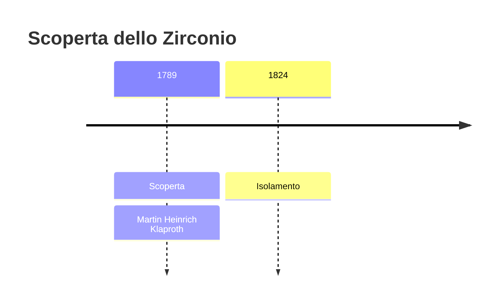
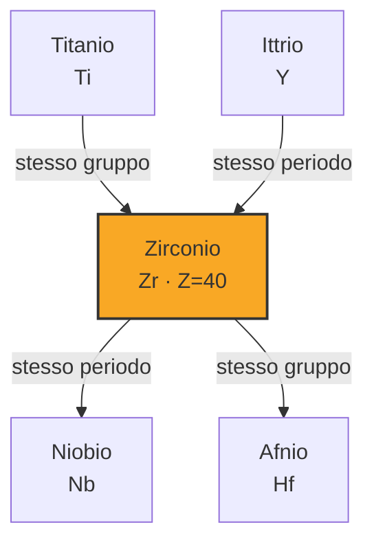
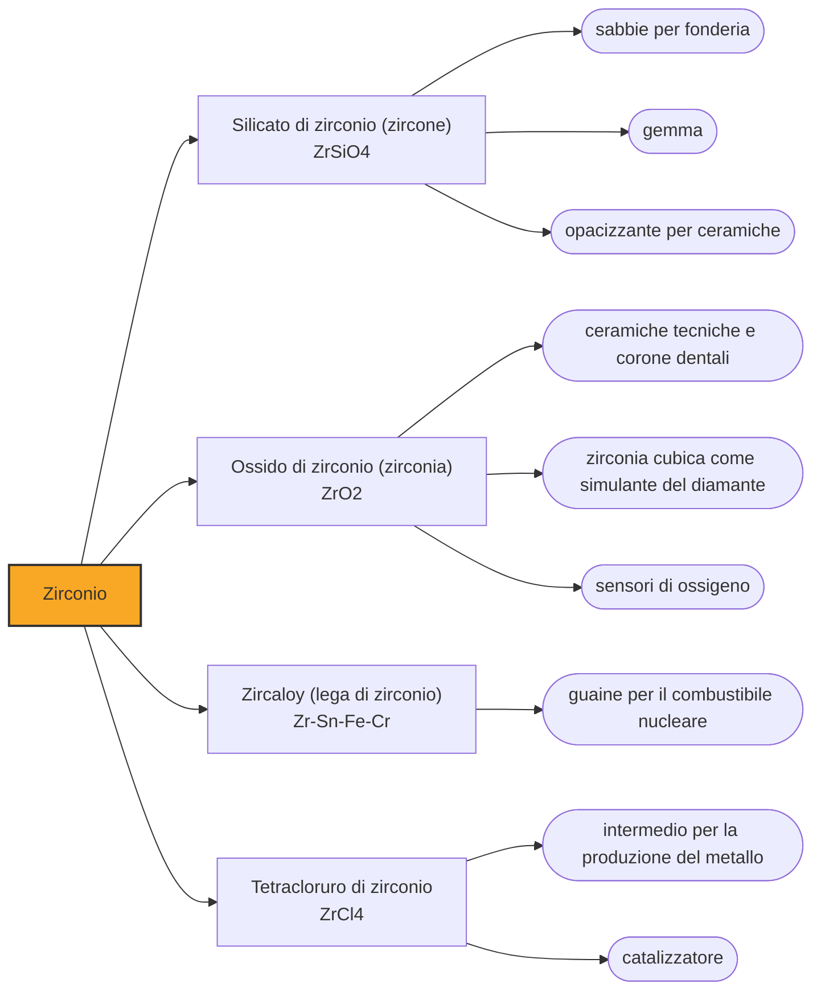

# Zirconio (Zr)

> [!abstract] 33° elemento scoperto — 1789
> Sta dentro una gemma che imita il diamante e dentro le barre di combustibile dei reattori nucleari, per la stessa ragione: lascia passare indisturbato tutto quello che altri materiali fermerebbero.

Lo zirconio è un metallo grigio chiaro, duro e straordinariamente resistente alla corrosione, che il pubblico conosce sotto due travestimenti in cui non compare mai come metallo: la zirconia delle finte pietre preziose e delle corone dentali, e lo zircone, la gemma da cui viene il nome. È anche il materiale che tiene insieme, dentro i reattori, il combustibile nucleare.

## Cronologia della scoperta

## Storia della scoperta

La gemma viene prima dell'elemento di parecchi millenni. Lo zircone è un minerale duro, brillante e fortemente rifrangente, noto ai gioiellieri dell'Oriente in tutte le sue tinte, dal bruno al giallo dorato al rosso; arrivava in Europa da Ceylon, l'attuale Sri Lanka, ed era chiamato con nomi che ne descrivevano il colore, fra cui il persiano zargun, colore d'oro, da cui la parola giargone e infine zircone.

Nel 1789, a Berlino, Martin Heinrich Klaproth prende uno di quei giargoni cingalesi e lo tratta come si tratta un problema, non come si tratta un gioiello. Lo fonde con alcali, ne scioglie il prodotto, precipita e pesa: la terra che ottiene non corrisponde né all'allumina né alla calce né a nessuna delle terre in catalogo. La chiama Zirkonerde, terra di zircone, e con essa mette in tabella un elemento che nessuno ha visto.

È il modo di lavorare che in quegli anni sta cambiando la chimica. Il metodo che Klaproth pratica e diffonde consiste nel separare per via umida i componenti di un minerale, farli precipitare uno alla volta in forma definita e pesarli: l'analisi diventa una contabilità, e ogni residuo che non torna nei conti è la traccia di qualcosa di ignoto. In questo stesso 1789 il metodo gli fa trovare due elementi, e la zirconia è il primo.

Dalla terra al metallo, però, la strada è lunga quanto quella di tutti gli elementi che si legano all'ossigeno con troppa forza. Humphry Davy ci prova con l'elettricità nel 1808, come aveva fatto con gli alcalini, e non ne cava nulla. Ci riesce nel 1824 Jöns Jacob Berzelius, scaldando il fluorozirconato di potassio con il potassio metallico: ottiene una polvere nera che è zirconio, ma impuro e fragile, buona a dimostrare l'esistenza dell'elemento e a nient'altro.

Lo zirconio lucente e malleabile che si vede oggi è una conquista del Novecento. Nel 1925 gli olandesi Anton van Arkel e Jan de Boer misero a punto un procedimento elegante: far reagire il metallo sporco con iodio, lasciare che il vapore del composto si depositi su un filamento incandescente e vi si decomponga, abbandonando lì lo zirconio puro. Tutte le impurità restano indietro, e sul filo cresce una barra cristallina. Il metallo era rimasto irriconoscibile per un secolo perché nessuno lo aveva mai visto pulito.

## Posizione nella tavola periodica

## Caratteristiche

La proprietà che ne fa la fortuna industriale è la stessa che rende il titanio prezioso, portata all'estremo: appena esposto all'aria lo zirconio si copre di un velo di ossido sottile, compatto e tenacissimo, che lo protegge da acidi e alcali dove quasi ogni altro metallo si sfalda. Gli impianti chimici che devono resistere agli acidi bollenti si costruiscono in zirconio quando l'acciaio inossidabile non basta più.

La proprietà che gli ha dato un mestiere unico, invece, non si vede e non si tocca. Lo zirconio cattura i neutroni con una riluttanza rarissima fra i metalli: li lascia passare quasi tutti invece di assorbirli, e in un reattore questo significa non rubare alla reazione a catena le particelle che la tengono in vita. Un metallo che resiste all'acqua bollente, alle radiazioni e al calore, e per giunta è trasparente ai neutroni, è esattamente ciò che serve per rivestire il combustibile.

C'è però un dettaglio che rende quella virtù laboriosa da ottenere. Lo zirconio in natura è sempre accompagnato dall'afnio, che gli somiglia chimicamente al punto da essere quasi inseparabile, e che si comporta in modo opposto verso i neutroni: li assorbe avidamente. Per l'uso nucleare bisogna dunque separare due gemelli chimici fino a lasciarne uno quasi puro, e l'afnio scartato trova impiego proprio dove serve il contrario, nelle barre di controllo che la reazione la spengono.

### Dati fisico-chimici

| Proprietà | Valore |
|---|---|
| Numero atomico | 40 |
| Massa atomica | 91,2242 u |
| Categoria | Metallo di transizione |
| Gruppo | 4 |
| Periodo | 5 |
| Blocco | d |
| Configurazione elettronica | [Kr] 4d² 5s² |
| Punto di fusione | 1854,9 °C |
| Punto di ebollizione | 4376,9 °C |
| Densità | 6,52 g/cm³ |
| Stati di ossidazione | -2, +1, +2, +3, +4 |

## Struttura atomica

![[atomo-Zirconio.svg]]

## Usi e presenza in natura

In termini di quantità, la parte del leone la fanno i composti e non il metallo. La sabbia di zircone va nelle forme e nei rivestimenti delle fonderie, dove regge il metallo fuso senza reagire, e nella ceramica; la zirconia stabilizzata è una ceramica tenace che resiste al calore e all'abrasione, e in odontoiatria ha soppiantato le corone metalliche perché è resistente, biocompatibile e del colore giusto.

La stessa zirconia, fatta crescere in cristalli cubici, è il più convincente sostituto del diamante mai messo in commercio: rifrange la luce quasi quanto il diamante e la disperde in colori anche di più, costa una frazione infinitesima e a occhio nudo inganna quasi chiunque. La differenza si vede col peso, con la conducibilità termica e con gli spigoli, che nella zirconia si arrotondano prima.

## Curiosità

Lo zircone è l'orologio più antico che il pianeta possieda. Quando cristallizza accoglie volentieri atomi di uranio al posto dello zirconio e rifiuta invece il piombo: ogni atomo di piombo che vi si trova dentro è dunque uranio decaduto, e il rapporto fra i due dice quanti anni ha il cristallo. Poiché lo zircone sopravvive a erosioni, sepolture e rifusioni, i granelli dei Jack Hills, in Australia occidentale, hanno restituito l'età di circa 4,4 miliardi di anni: sono i più antichi frammenti di Terra che si conoscano.

La virtù nucleare dello zirconio ha un rovescio che si è visto in incidente. Se il rivestimento si surriscalda oltre il migliaio di gradi, il metallo strappa l'ossigeno al vapore acqueo che dovrebbe raffreddarlo e libera idrogeno; l'idrogeno si accumula e, incontrando aria, esplode. Sono le esplosioni che nel marzo 2011 scoperchiarono gli edifici dei reattori di Fukushima, e non erano esplosioni nucleari ma chimiche, prodotte dallo stesso metallo scelto per la sua trasparenza ai neutroni.

## Nella cronologia

← Precedente: [[Boro]] (1787)
→ Successivo: [[Uranio]] (1789)

Epoca: [[Chimica pneumatica]] · Scopritore: [[Martin Heinrich Klaproth]]

## Fonti

- [Zirconium](https://en.wikipedia.org/wiki/Zirconium) — consultata il 07/09/2026
- [Zircon](https://en.wikipedia.org/wiki/Zircon) — consultata il 07/09/2026
- [Jack Hills](https://en.wikipedia.org/wiki/Jack_Hills) — consultata il 07/09/2026
- [Martin Heinrich Klaproth](https://en.wikipedia.org/wiki/Martin_Heinrich_Klaproth) — consultata il 07/09/2026
