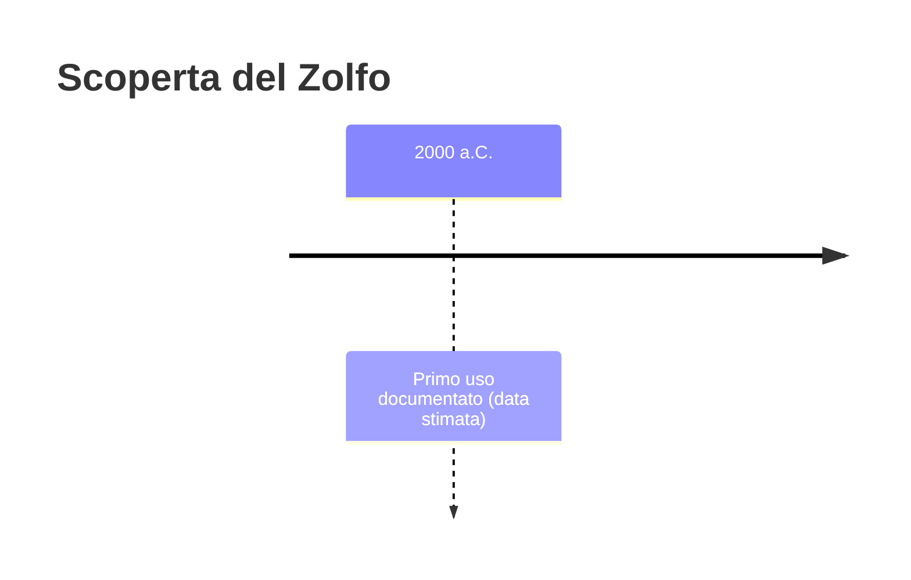
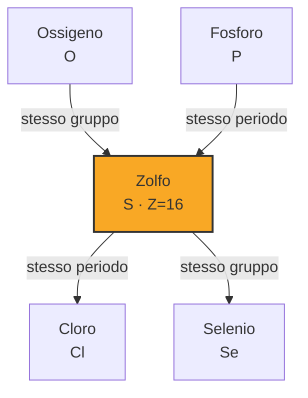

# Zolfo (S)

> [!abstract] 9° elemento scoperto — 2000 a.C.
> 

## Cronologia della scoperta

## Storia della scoperta

## Posizione nella tavola periodica

## Caratteristiche

### Dati fisico-chimici

| Proprietà | Valore |
|---|---|
| Numero atomico | 16 |
| Massa atomica | 32,06 u |
| Categoria | Non metallo |
| Gruppo | 16 |
| Periodo | 3 |
| Blocco | p |
| Configurazione elettronica | [Ne] 3s² 3p⁴ |
| Punto di fusione | 115,2 °C |
| Punto di ebollizione | 444,7 °C |
| Densità | 2,07 g/cm³ |
| Stati di ossidazione | — |

## Struttura atomica

![[atomo-Zolfo.svg]]

## Usi e presenza in natura

## Nella cronologia

← Precedente: [[Antimonio]] (3000 a.C.)
→ Successivo: [[Mercurio]] (1500 a.C.)

Epoca: [[Antichità]]

## Fonti

