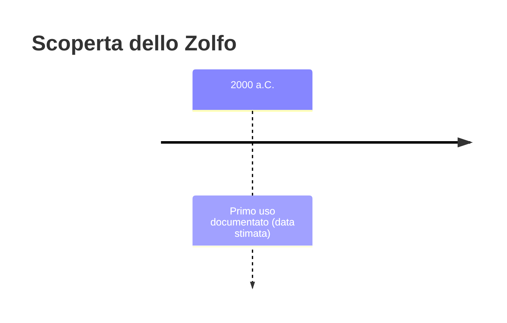
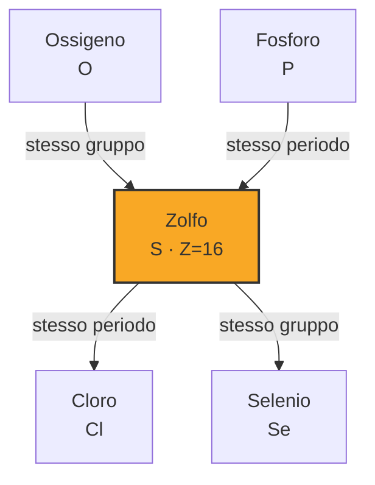
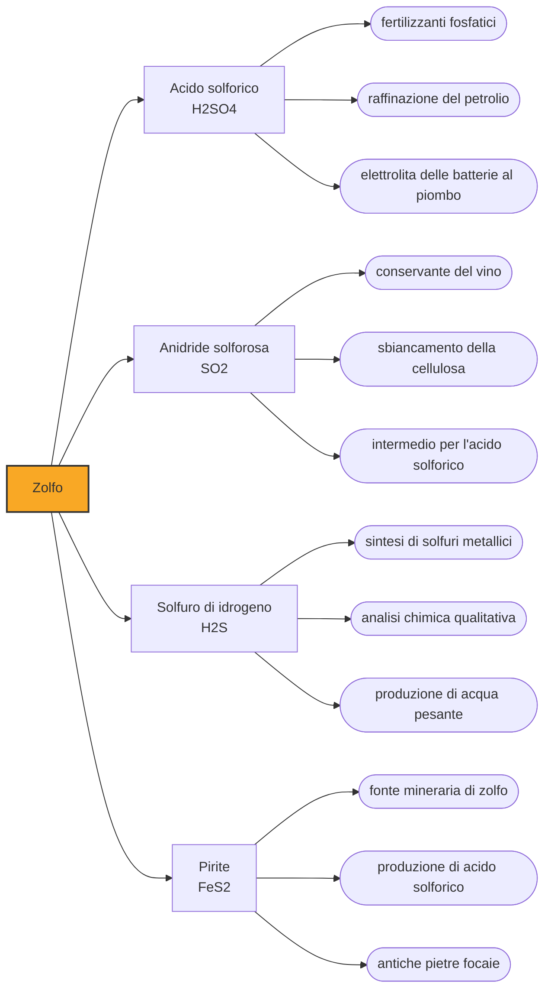

# Zolfo (S)

> [!abstract] 9° elemento scoperto — 2000 a.C.
> Lo zolfo non è stato scoperto da nessuno: giace giallo e puro sui fianchi dei vulcani, dove chiunque può raccoglierlo. Il problema, per l'antichità, non era trovarlo ma capire che cosa fosse quella pietra che bruciava con fiamma azzurra e un odore da inferno.

Lo zolfo appartiene alla piccolissima famiglia degli elementi che la natura offre già puri: cristalli gialli depositati attorno alle fumarole vulcaniche, dove il gas che risale dal sottosuolo si raffredda. Ottenerlo non richiede alcuna tecnica, solo il coraggio di andarlo a prendere.

## Cronologia della scoperta

## Storia della scoperta

La prima cosa che l'uomo impara dello zolfo è che brucia, e che il fumo di quella combustione uccide. Nel ventiduesimo libro dell'Odissea, dopo la strage dei pretendenti, Odisseo chiede alla nutrice Euriclea di portargli fuoco e zolfo per purificare la sala: è una delle più antiche descrizioni scritte di una fumigazione chimica. Il gesto ha insieme un senso rituale e uno pratico, perché l'anidride solforosa che si sprigiona bruciando zolfo è effettivamente un disinfettante che stermina muffe, batteri e insetti.

Accanto all'uso purificatorio corre quello medico. Il papiro Ebers, redatto in Egitto intorno al 1550 a.C., prescrive un unguento a base di zolfo contro l'infiammazione granulare delle palpebre, ed è una delle testimonianze più antiche di una terapia dermatologica che si è dimostrata longeva: gli unguenti sulfurei contro scabbia e affezioni cutanee restano in farmacopea fino al Novecento.

I Romani ne hanno un catalogo d'usi già preciso. Plinio il Vecchio elenca quattro qualità di zolfo e altrettante applicazioni: la medicina, la follatura dei tessuti, lo sbiancamento della lana e i lucignoli delle lampade. Indica anche la fonte principale del mondo antico, l'isola egea di Milo.

La svolta concettuale arriva con l'alchimia, che allo zolfo assegna un ruolo che va molto oltre l'utilità pratica. Nella teoria dei tria prima codificata da Paracelso nel Cinquecento, ogni sostanza materiale nasce dalla combinazione di tre principi: il mercurio, che dà fluidità e metallicità, il sale, che dà solidità, e lo zolfo, che dà combustibilità e colore. Non è lo zolfo del minerale, è un principio astratto che prende nome dal minerale, ma per due secoli quella triade è lo schema con cui l'Europa colta pensa la materia.

In Cina lo zolfo percorre una strada parallela. I testi lo nominano dal VI secolo a.C., e nel III secolo d.C. lo si estrae già dalla pirite; i taoisti, che lo maneggiano cercando elisir di lunga vita, ne scoprono per via sperimentale la reattività violenta. La combinazione di zolfo, salnitro e carbone di legna che ne deriva è la polvere da sparo, ottenuta cercando l'immortalità e trovando esattamente il contrario.

Lo zolfo diventa un elemento chimico, e non più un principio, nel 1777, quando Antoine Lavoisier lo classifica fra le sostanze semplici. Non è un ritrovamento: è il momento in cui una materia nota da millenni cambia statuto, da ingrediente della cosmologia alchemica a casella della chimica.

> [!warning] Questione aperta
> Datare lo zolfo significa scegliere che cosa contare. Il minerale nativo è disponibile e riconoscibile da sempre attorno ai crateri, e le testimonianze del suo impiego arrivano da fronti diversi che non coincidono: il papiro Ebers, in Egitto, ne registra l'uso in un unguento oftalmico intorno al 1550 a.C.; i testi cinesi nominano lo shiliuhuang dal VI secolo a.C.; l'Odissea lo fa bruciare a Odisseo per purificare la sala. Nessuna di queste date è la scoperta, perché non c'è stato niente da scoprire: la data del 2000 a.C. adottata qui è una convenzione che colloca lo zolfo fra i materiali già correnti nell'età del bronzo, non un evento documentato.

## Posizione nella tavola periodica

## Caratteristiche

Lo zolfo detiene un primato bizzarro: nessun altro elemento ha così tante forme cristalline. La più stabile è l'ottazolfo, molecole ad anello di otto atomi in un reticolo giallo limone. Fuso e versato di colpo in acqua fredda dà invece lo zolfo plastico: gli anelli si aprono in catene elicoidali lunghissime e la massa diventa bruna ed elastica come gomma, per tornare gialla e friabile nel giro di ore.

Chimicamente lo zolfo è versatile quanto pochi: la letteratura gli riconosce stati di ossidazione dal meno due al più sei, ma nella pratica quasi tutto ciò che si incontra sta in quattro caselle. Meno due sono i solfuri, dai minerali metallici all'uovo marcio; più quattro è l'anidride solforosa, quella che disinfettava la sala di Odisseo e che oggi conserva il vino; più sei è l'acido solforico. È questa scala di ossidazione a renderlo utile: lo zolfo cede e accetta elettroni con la stessa disinvoltura.

Va sfatato un equivoco tenace: lo zolfo puro non ha odore. Puzzano i suoi composti, e in modo memorabile. L'idrogeno solforato è l'uovo marcio, i tioli sono l'aglio, la cipolla e lo spruzzo della puzzola. L'industria del gas ne aggiunge deliberatamente una traccia al metano, che è inodore, perché una perdita si senta prima di diventare un'esplosione: il naso umano li riconosce a poche parti per miliardo.

### Dati fisico-chimici

| Proprietà | Valore |
|---|---|
| Numero atomico | 16 |
| Massa atomica | 32,06 u |
| Categoria | Non metallo |
| Gruppo | 16 |
| Periodo | 3 |
| Blocco | p |
| Configurazione elettronica | [Ne] 3s² 3p⁴ |
| Punto di fusione | 115,2 °C |
| Punto di ebollizione | 444,7 °C |
| Densità | 2,07 g/cm³ |
| Stati di ossidazione | -2, -1, 0, +1, +2, +3, +4, +5, +6 |

## Struttura atomica

![[atomo-Zolfo.svg]]

## Usi e presenza in natura

La destinazione principale dello zolfo è l'acido solforico, la sostanza chimica più prodotta al mondo in assoluto. Non finisce quasi mai nelle mani del pubblico: serve a fabbricare fertilizzanti fosfatici, a raffinare il petrolio, a lavorare i metalli. Il consumo di acido solforico di un paese è stato a lungo usato come indicatore grezzo del suo livello di industrializzazione.

Il secondo uso è meno voluminoso ma altrettanto pervasivo. Nella vulcanizzazione, brevettata nel 1843, lo zolfo crea ponti fra le catene del polimero della gomma naturale, che smette così di essere appiccicosa a caldo e fragile a freddo: ogni pneumatico esistente dipende da quella reazione. Restano poi gli usi antichi, mai abbandonati, come lo zolfo in polvere che difende i vigneti dall'oidio.

## Curiosità

Lo zolfo è dentro ogni essere vivente, in due dei venti amminoacidi che compongono le proteine, la cisteina e la metionina. Sono i ponti disolfuro fra le cisteine a dare rigidità alla cheratina di capelli, unghie e piume: la stessa reazione che rende elastico uno pneumatico tiene in forma un capello. Una permanente dal parrucchiere non è altro che la rottura chimica di quei ponti e la loro ricostruzione su una forma diversa.

Il nome greco dello zolfo, theion, somiglia da vicino a theios, divino, e quella vicinanza fonetica ne ha fissato per secoli l'aura sacra e insieme infernale. È la sostanza che nella Genesi piove col fuoco su Sodoma e Gomorra e che nell'Apocalisse forma lo stagno ardente. Nessun altro elemento chimico ha una carriera religiosa così lunga.

## Nella cronologia

← Precedente: [[Antimonio]] (3000 a.C.)
→ Successivo: [[Mercurio]] (1500 a.C.)

Epoca: [[Antichità]]

## Fonti

- [Sulfur](https://en.wikipedia.org/wiki/Sulfur) — consultata il 07/09/2026
- [Homer, Odyssey, Book 22 (Theoi Classical Texts Library)](https://www.theoi.com/Text/HomerOdyssey22.html) — consultata il 07/09/2026
- [Oxidation state (tabella degli stati noti per elemento)](https://en.wikipedia.org/wiki/Oxidation_state) — consultata il 07/09/2026
